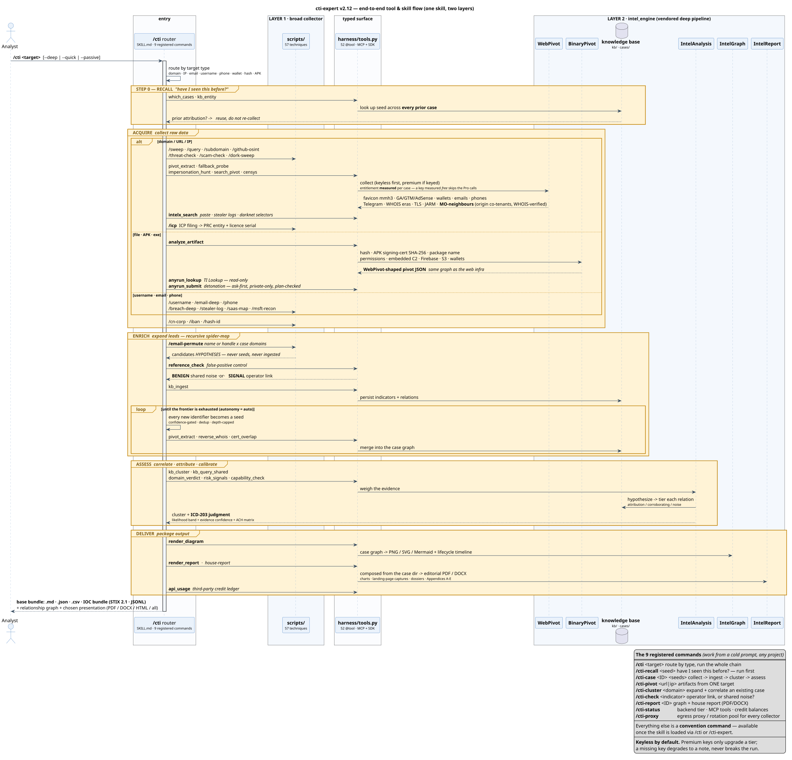
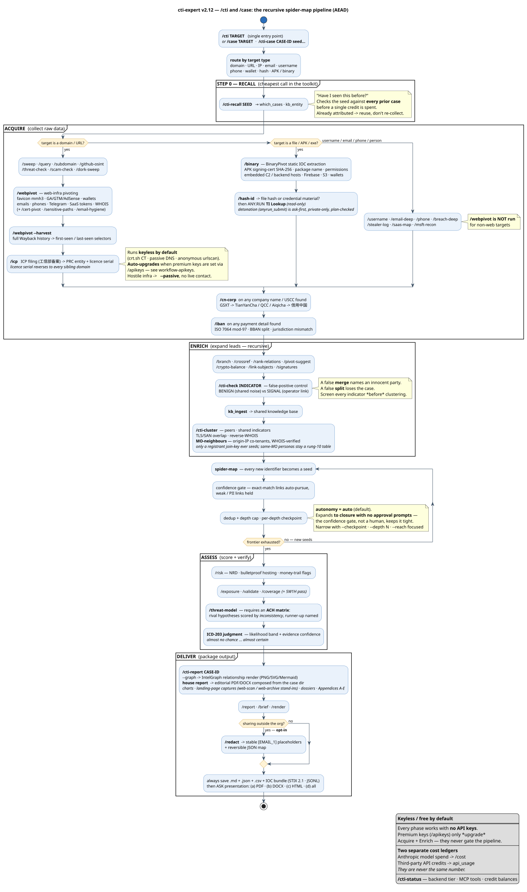
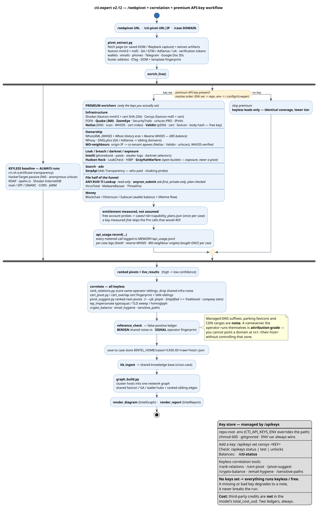

<div align="center">

# CTI Expert

### Cyber Threat Intelligence & OSINT Analysis Toolkit

**Transform Claude into a trained intelligence analyst — 120+ commands, 56 techniques, zero API keys required for core functionality.**

<br>

<p>
  <a href="#installation">Installation</a>&nbsp;&nbsp;|&nbsp;&nbsp;<a href="#demo">View Demo</a>&nbsp;&nbsp;|&nbsp;&nbsp;<a href="#quick-start">Quick Start</a>&nbsp;&nbsp;|&nbsp;&nbsp;<a href="#command-reference">Commands</a>&nbsp;&nbsp;|&nbsp;&nbsp;<a href="#contributing">Contribute</a>
</p>

<br>

<!-- Feature Badges -->
<p>
  <a href="https://github.com/7onez/cti-expert"></a>&nbsp;
  <a href="LICENSE"></a>&nbsp;
  <a href="#command-reference"></a>&nbsp;
  <a href="#technique-catalog"></a>&nbsp;
  <a href="#installation"></a>
</p>

<!-- GitHub Stats -->
<p>
  <a href="https://github.com/7onez/cti-expert/stargazers"></a>&nbsp;
  <a href="https://github.com/7onez/cti-expert/network/members"></a>&nbsp;
  <a href="https://github.com/7onez/cti-expert/releases"></a>&nbsp;
  <a href="https://github.com/7onez/cti-expert/issues"></a>&nbsp;
  <a href="https://github.com/7onez/cti-expert/pulls"></a>&nbsp;
  <a href="https://github.com/7onez/cti-expert/commits"></a>&nbsp;
  <a href="https://github.com/7onez/cti-expert"></a>&nbsp;
  <a href="https://github.com/7onez/cti-expert/graphs/contributors"></a>
</p>

<!-- Language Selector -->
<p>
  🇬🇧 <a href="README.md"><b>English</b></a>&nbsp;&nbsp;·&nbsp;&nbsp;🇻🇳 <a href="README.vi.md">Tiếng Việt</a>&nbsp;&nbsp;·&nbsp;&nbsp;🇨🇳 <a href="README.zh-CN.md">中文</a>
</p>

<br>

<sub>Built by <a href="https://www.linkedin.com/in/hieu-minh-ngo-hieupc/"><b>Hieu Ngo</b></a> &bull; <a href="mailto:hieu.ngo@chongluadao.vn">hieu.ngo@chongluadao.vn</a> &bull; <a href="https://chongluadao.vn">chongluadao.vn</a></sub>
<br>
<sub>Core contributor &bull; <a href="https://github.com/Zeroska"><b>Zeroska</b></a></sub>

</div>

<br>

---

<br>

## 🤝 Sponsors &amp; Supporters

<div align="center">

**CTI Expert is built in the open. These organisations back the work — with data, tooling, and hard-won investigative tradecraft.**

<p>
  <a href="https://rexxfield.com"></a>&nbsp;
  <a href="https://www.hudsonrock.com"></a>&nbsp;
  <a href="https://paranoidlab.com"></a>
</p>
<p>
  <a href="https://any.run"></a>&nbsp;
  <a href="https://zetalytics.com"></a>&nbsp;
  <a href="https://intelx.io"></a>
</p>
<p>
  <a href="https://www.shodan.io"></a>&nbsp;
  <a href="https://censys.com"></a>&nbsp;
  <a href="https://urlscan.io"></a>
</p>
<p>
  <a href="https://serpapi.com"></a>&nbsp;
  <a href="https://grayhatwarfare.com"></a>&nbsp;
  <a href="https://sociallinks.io"></a>
</p>
<p>
  <a href="https://validin.com"></a>&nbsp;
  <a href="https://netlas.io"></a>
</p>

</div>

| Supporter | What they bring | In the toolkit |
|-----------|-----------------|----------------|
| [**Rexxfield**](https://rexxfield.com) | Cybercrime investigation and victim-side casework since 2008 — the real-world tradecraft the case workflow and attribution standards are modelled on | Tradecraft &amp; methodology |
| [**ChongLuaDao**](https://chongluadao.vn) ⭐ | **First-party** — the project's home org. Premium VN threat intel: ~20M-URL denylist verdicts, deep AI URL analysis, IoC + data-leak/breach exposure, brand lookalikes and CVE/KEV feeds — your client talks only to CLD, which fetches the target server-side (never your egress) | `/cld` · `/scam-check` · `/threat-check` · `/breach-deep` |
| [**Hudson Rock**](https://www.hudsonrock.com) | Infostealer-infection intelligence — which machines leaked which credentials, and when | `/breach-deep` · `/stealer-log` |
| [**ParanoidLab**](https://paranoidlab.com) | Dark-web, Initial-Access-Broker and infostealer-log monitoring across forums, markets and private Telegram | Dark-web collection &amp; review |
| [**ANY.RUN**](https://any.run) | Interactive malware sandbox + **TI Lookup** — sandbox-observed C2 and real endpoints from packed samples | `/binary` · `/hash-id` |
| [**ZETAlytics**](https://zetalytics.com) | Global passive DNS with rare geographic diversity — historical resolution and co-tenancy pivots | `/webpivot` · `/cti-pivot` |
| [**IntelX**](https://intelx.io) | Intelligence X — paste sites, leaks, darknet and phonebook selector search | `/webpivot` · `/email-deep` |
| [**Shodan**](https://www.shodan.io) | Internet-connected host &amp; service intelligence — open ports, banners, tags and known CVEs, passive-first via InternetDB | `/webpivot` · `/appliance-scan` · `/cert-pivot` |
| [**Censys**](https://censys.com) | Internet-wide host &amp; certificate scanning — the server-side view; every host on an exact leaf certificate (works on the free plan) | `/censys` · `/cert-pivot` |
| [**URLScan.io**](https://urlscan.io) | Passive website scanning — what a page served and who it talked to, captured without touching the target | `/webpivot` · `/impersonate` |
| [**SerpApi**](https://serpapi.com) | Search-engine + Google Ads Transparency results API — who *paid* to send traffic, plus multi-engine dork results | `/serp` · `/search-pivot` |
| [**GrayHatWarfare**](https://grayhatwarfare.com) | Open cloud-bucket &amp; exposed-file search (S3/Azure/GCS/Spaces) — graded **exposure**, not a same-operator pivot | `/secrets` · `/docleak` |
| [**Social Links**](https://sociallinks.io) | OSINT investigation platform — 1000+ methods across social media, blockchain and the dark web (SL Professional / Crimewall, Maltego transforms) | OSINT methodology &amp; data |
| [**Validin**](https://validin.com) | DNS + certificates + favicon + response-body hashes in one graph — passive DNS, subdomain enumeration, reverse-IP and host-response hash pivots on a free community key | Native in `/webpivot` (domain lookup, reputation, cert &amp; favicon hosts) · MO-neighbour source · `/cti-pivot` |
| [**Netlas**](https://netlas.io) | Independent internet-asset index — DNS, scan responses, WHOIS and certificate collections behind one key; `domains a:<origin-ip>` reverses a non-CDN origin to every apex with dates | `/webpivot` MO-neighbour source · `intel.py netlas` · entitlement probe |

> [!IMPORTANT]
> **ANY.RUN lookups are read-only; detonation is gated.** `anyrun_lookup` queries TI Lookup for hashes that have *already* been detonated. `anyrun_submit` can detonate a file or URL, but only behind a per-submission analyst confirmation (a briefing-then-`confirm=true` two-step), private-by-default privacy with `public` refused, a fail-closed plan check (the account's own `/user` private quota — zero is denied outright — else a prior private task, else an explicit analyst attestation to a paid plan), a post-submit privacy read-back that withdraws and flags a task that still landed public, and a harness deny unless `HARNESS_ALLOW_SUBMIT=1`. A public sandbox task is world-readable and irreversible; the gate is enforced by a regression test ([`tests/test_no_sample_submission.py`](tests/test_no_sample_submission.py)), not just by convention.

<sub>Listing here reflects support for the project and does <b>not</b> imply affiliation, endorsement, or any verification of this tool by the organisations named. Integrations marked above are optional and key-gated — <b>every core technique still runs with zero API keys</b>. Always respect each provider's terms of service. The full list of open-source projects and free public-interest services this skill depends on is in <a href="#-acknowledgments--credits">Acknowledgments &amp; Credits</a>.</sub>

<br>

---

<br>

## What is CTI Expert?

A **Claude Code skill** that transforms Claude into a trained cyber threat intelligence and open-source intelligence analyst. It runs structured intelligence collection using **120+ commands** across **56 techniques** — no API keys required for core functionality. To take full advantage, add your own **free *or* paid** API keys to the skill's `.env` — each is **auto-detected** and unlocks higher-tier access (e.g., Wigle, VirusTotal, URLScan.io, Shodan, Censys, SecurityTrails, WhoisXML).

> [!TIP]
> **Keyless by default, more powerful with your keys.** Every core technique runs with zero API keys. Add any free or paid keys to `.env` (or run `/apikeys set <service> <KEY>`) and the skill auto-detects them, unlocking higher-tier pivots: reverse favicon→host, passive DNS, certificate search, sibling-domain discovery. A missing or bad key never breaks a run — it just degrades to a note. Setup guide: [handbook/api-keys.md](handbook/api-keys.md).

> [!TIP]
> **One skill, two layers.** cti-expert is the *broad collector* — the wide net (`/sweep`, `/webpivot`, `/subdomain`, `/username`, `/email-deep`…). Built into the repo is a *deep pipeline* (`intel_engine/`) that turns raw collection into a real case: a persistent knowledge base, versioned cases, cross-case correlation, and calibrated assessment. The flow reads like a sentence — **collect broadly → "seen this operator before?" → cluster → filter false positives → assess.** No external setup: the backend resolves to `SELF`, and **as of v2.9 the bundled installer (`scripts/install.{sh,ps1}`) provisions the deep layer automatically** (or by hand: `uv venv && uv pip install -r requirements.txt`). Architecture: [connectors/intel-backend.md](connectors/intel-backend.md).

<table>
<tr>
<td width="50%">

**Core Capability**

Multi-vector reconnaissance on any target type — person, domain, organization, username, email, IP, WiFi — with automated finding validation, exposure scoring, and structured intelligence delivery.

</td>
<td width="50%">

**AEAD Workflow**

**A**cquire raw data &rarr; **E**nrich with pivot expansion &rarr; **A**ssess findings &rarr; **D**eliver structured reports — the base bundle (Markdown + JSON + CSV + IOC bundle) always saves, then you pick a presentation report: PDF, DOCX, HTML, or all.

</td>
</tr>
</table>

<br>

---

<br>

## Demo

### Full Case Investigation

<div align="center">

</div>

<br>

### CTI Report Generation

<div align="center">

</div>

<br>

### Screenshots

<div align="center">

| INTSUM Report | Network Topology | Risk Assessment |
|:---:|:---:|:---:|
|  |  |  |

</div>

<br>

---

<br>

## What's New in v2.12

> **The release where the premium keys start pulling their weight — and the report writes itself.** v2.11 shipped detectors. v2.12 turns an eight-finding audit of the paid vendors into behaviour (every metered leg gated, bought **once per case** instead of once per host), adds **Netlas** as an independent index, makes the editorial PDF/DOCX a **deterministic composition** from the case directory, and closes the last honesty gap in the ANY.RUN docs: detonation exists, and it is gated five ways.

| Category | What's New | Details |
|----------|-----------|---------|
| **MO-neighbour pivot** | Reverse a non-CDN origin to its co-tenants — and only ever seed on a registrant join key | `wp_mo_neighbours.discover` reverses the estate's non-CDN origin IP (also the MX origin) through **Netlas · Validin · urlscan**, WHOIS-verifies each candidate apex, and classifies it `same_registrant` (current registrant e-mail/phone join key only — a proxied record contributes **no** phone) / `same_mo` (reference-data policy) / `unrelated` / `unverifiable`. **Only `same_registrant` seeds the frontier**; same-MO personas render as a rung-10 *Related personas* table in the report (`--mask-personas` to aggregate). A bulk-hosting guard fires *before* any spend; per-origin lock + disk cache + a per-run WhoisXML ledger hold across collector subprocesses, so an origin is bought once per case. RULE 5 rails intact: facts-only KB ingest, never an edge, never an `operator_lead` |
| **WHOIS eras · urlscan Pro lifecycle** | The timeline now knows who held the name *before* this operator | WHOIS history is an explicit `--whois-history purchase` scoped to seeds and cluster members (the render path never buys it); the house report renders a **Registrant eras** table (same-day flaps folded, registrar placeholders classed) and uses the current era's start as the archive-capture cutoff. urlscan **Pro** supplies the hostname lifecycle index — A/NS eras, CT and zonefile firsts, left-censored on a truncated walk — feeding the temporal view; verdict rows appear only on signal, and the API key is sent to urlscan.io only |
| **Entitlement measured, not assumed** | A key measured *free* skips the calls that would 403 | `wp_capabilities.discover_plans` probes each vendor's **free account endpoint** (urlscan quotas, Netlas plan, SecurityTrails/DNSLytics usage, IntelX `/authenticate/info`, Validin `/api/paths`) once per case into `cases/<id>/capability_plans.json`; `enrich_live` reads the store and gates **only on a positive `free`** verdict — unknown keeps the productive call as the probe. Censys search records its own verdict. A failed probe is reported this run and never frozen, so the next process re-measures |
| **Netlas + the rest of the vendor wiring** | Every registered key now has a pivot behind it | [`wp_netlas.py`](intel_engine/WebPivot/tools/wp_netlas.py) — Bearer client over the `domains` · `responses` · `whois_domains` · `whois_ip` · `certs` collections (search, count, facet, reverse-IP, plan), keyless query builder + web-UI links, ledgered, Cloudflare-safe UA; `intel.py netlas ip\|ns\|spf\|domain\|san\|title\|plan\|raw`. Live-measured: `domains a:<origin>` returned **32 apexes** on a 32-domain estate (15 members + same-MO siblings under other personas). Alongside: **SecurityTrails** DNS-history eras + DSL reverse-WHOIS (diffed against WhoisXML), **DNSLytics** reverse-IP under its own co-tenancy-routed key, **GrayHatWarfare** exposure lead + report section, **Shodan** cert/JARM search, once-per-case **Censys** cert search with a shared-cert fan-out guard, **IntelX** auto-fire in `pipeline open` (loop: `--full` only; role mailboxes excluded), and **Validin** wired natively (domain lookup, reputation, cert and favicon hosts). Frontier ranks owner-link candidates above lookalikes |
| **The house report, composed deterministically** | The editorial PDF/DOCX no longer needs a model to write it | `intel.py house-report <CASE-ID>` composes the IntelReport document from the case dir: sections I–XI, both confidence scales + the **ICD-203 × Admiralty scatter**, relationship graph + **entity-relationship map**, attribution inference chain, temporal view + **registration heatmap** + **domain × shared-indicator matrix** (which honours the §2.5 false-positive control and carries the WHOIS join keys), a **landing-page capture** per estate host (proxy-gated egress; a page that will not render falls back to the newest public **web-scan**, then a **web-archive** snapshot — captioned, dated by the archive, and labelled a *previous owner's page* when it predates the current registration), per-domain **dossiers**, a glossary, Appendices **A–E**. Rule 12 scrub of tool/vendor/path names; third parties masked through one gate ([`scripts/cti_third_party_mask.py`](scripts/cti_third_party_mask.py)). One figure source ([`scripts/cti_report_figures.py`](scripts/cti_report_figures.py)) feeds both the dashboard DOCX and the house PDF, so the two deliverables cannot disagree. `--no-screenshots` is fully offline; `--no-archive-fallback` forbids the stand-ins |
| **ANY.RUN: the gate is real, and the docs now say so** | Detonation exists — behind five gates, each of them code | SKILL.md, the README callouts, `.env.example` and the key registry claimed "no submit path". False since the gated layer landed. `anyrun_submit` is gated by: per-submission confirmation (a `confirm=false` **briefing** first — a data-driven `approval_briefing` exemption in `tool_policy.json` now lets that step through the MCP approval gate, fail-closed to fully gated if the file is unreadable); **private by default**, `public` refused unless `ANYRUN_ALLOW_PUBLIC=1` grants a *standing* authorization, and then only as an explicit, recorded downgrade; a **fail-closed plan check** (`/user` private quota — zero is denied and no attestation overrides it — else a prior private task, else `--i-have-a-paid-plan`); a **polled post-submit privacy read-back** that withdraws and flags a task that still landed public (`verify-privacy <uuid>` finishes the check if the task outlives the wait); and the harness deny unless `HARNESS_ALLOW_SUBMIT=1`. 103 stubbed checks in `test_intelx_anyrun` §7b–7c; `test_tool_gate` §2 pins briefing-allowed / confirm-denied / fail-closed |
| **Repo hygiene** | The tree checks itself for pasted keys | `audit.sh` §5b greps every tracked file for vendor key shapes and `KEY=value` lines — proven to fire on a planted value and clean on the tree, so a key can only live in `.env`. [AGENTS.md](AGENTS.md) rewritten as the cross-agent *Repository Guidelines*. Key-alias registries reconciled with every tool's `_secret()` lookup and locked ([`tests/test_key_alias_registry.py`](tests/test_key_alias_registry.py)); SecurityTrails / DNSLytics / CertSpotter registered so the capability banner stops going silent on keys it uses. The three workflow diagrams re-rendered from current sources — 52 `@tool`s, 9 commands, Netlas, gated ANY.RUN |

## What's New in v2.11

> **The eCrime-2026 follow-up batch — planned, then cooked.** Four deferred phases from the v2.10 research pass ship as keyless, offline, tested modules (planned in `plans/260826-1935-ecrime-2026-followup-analyzers/`, implemented via `/ak:cook`). Same contracts: zero-dep tests in `audit.sh`, attribution-safety (RULE 5). Full mapping: [docs/ecrime-research-integration.md](docs/ecrime-research-integration.md) §6.

| Category | What's New | Details |
|----------|-----------|---------|
| **APK permission-scope scoring** | On-device-fraud capability from the manifest | [`scripts/apk_permission_scope.py`](scripts/apk_permission_scope.py) scores dangerous-permission **combinations** (accessibility+overlay+SMS = banking-trojan profile) — the combination is the signal, not any single grant, so banking/AV apps aren't blindly flagged; result is **capability, not guilt**. Handles plaintext manifests and binary AXML (UTF-8 **and** UTF-16 string pools; a zero-permission decode degrades to a note, never a false "clean"). Extends BinaryPivot. Grounded in *"The 'Allow' Reflex"* (Kandagadla Srinivasamurthy, Dupuis — UW). See [`techniques/apk-permission-scope.md`](techniques/apk-permission-scope.md) |
| **Kit-template attribution** | Same-kit lineage across rotating hosts | [`scripts/kit_template_fingerprint.py`](scripts/kit_template_fingerprint.py) fingerprints DOM structure + harvest-form field-set + asset skeleton and grades similarity — but a **commodity template** (WordPress/Wix/Shopify) match is graded *noise*, not a same-operator link (§2.5 trap), and no grade ever auto-merges. Grounded in the Vicomtech *tree-structured attribution* paper. See [`techniques/kit-template-attribution.md`](techniques/kit-template-attribution.md) |
| **Renderer-level confirmation** | Dynamic confirmation of the static ClickFix/visibility verdicts | [`scripts/render_confirm.py`](scripts/render_confirm.py) feeds renderer-captured **runtime clipboard writes** and **computed-style hidden elements** into the existing detectors (via new additive seams) and reconciles static vs rendered — promoting a JS-assembled payload the static pass missed, or weighing a static-only HIGH. Renderer (Playwright/agent-browser) is optional and **degrades to a note**. Grounded in *PasteJacked* + *Visibility-Aware HTML*. See [`techniques/renderer-confirmation.md`](techniques/renderer-confirmation.md) |
| **PhishTrace dynamic features** | Characterize a page from its runtime trace | [`scripts/phishtrace_features.py`](scripts/phishtrace_features.py) turns a runtime trace (requests, redirects, form POSTs, cloaking) into a verdict + **exfil-endpoint IOCs** — where a thin/cloaked trace on a flagged page reads as **cloaked, never benign**, and exfil hosts are pivot leads, not attribution. Grounded in *"PhishTrace"* (Islam, Mannan). See [`techniques/phishtrace-dynamic-features.md`](techniques/phishtrace-dynamic-features.md) |
| **AAM actor-modeling overlay** | Anticipate the next move, not just attribute the past | [`handbook/aam-actor-modeling.md`](handbook/aam-actor-modeling.md) adds an optional `/threat-model` overlay (OODA faces + Mirror/Twin/Opposite/Lever) alongside ACH. Grounded in ISECOM's *"Modeling Adversaries Through Chaos"* training. Docs-only |
| **Tested & gated** | Four more zero-dep suites in `audit.sh` | `test_apk_permission_scope` (combo-vs-single + benign control + AXML zero-perm degrade), `test_kit_template_fingerprint` (commodity-trap RULE 5 guard + never-auto-merge), `test_render_confirm` (promotion + seam-additivity + no-renderer degrade), `test_phishtrace_features` (cloaked-not-benign) |

## What's New in v2.10

> **The release that turns APWG eCrime 2026 research into working, tested detectors.** Three keyless, offline, deterministically-tested analyzers land at the Enrich→Assess boundary, each mapped to a named eCrime 2026 paper — closing the two audited gaps: page-content threat classification, and an explicit maliciously-registered-vs-compromised call. Full mapping + repo audit: [docs/ecrime-research-integration.md](docs/ecrime-research-integration.md).

| Category | What's New | Details |
|----------|-----------|---------|
| **Phishing-domain survival profiling** | Registration/DNS strategy → maliciously-registered vs **compromised**, plus takedown-resilience | [`scripts/phish_domain_survival.py`](scripts/phish_domain_survival.py) turns collected WHOIS/DNS into a two-axis, fully auditable judgement (every signal carries a weight + reason; seed lists tunable via `--refs`). The compromised/malicious split is attribution-safety: a long-lived domain at an established registrar serving unrelated legitimate content is a **victim**, never named as the operator (RULE 5). Grounded in *"Built to Last? Registration and DNS Strategies in Phishing Domain Survival"* (Lim et al., eCrime 2026). See [`techniques/phishing-domain-survival.md`](techniques/phishing-domain-survival.md) |
| **ClickFix / PasteJacking detection** | Clipboard-hijack lures + `-EncodedCommand` decode → C2 IOCs | [`scripts/clickfix_detect.py`](scripts/clickfix_detect.py) scores three co-occurring families (clipboard write · social lure · OS-command payload) so a coupon "copy" button or the word *powershell* in prose never reads as HIGH; it decodes PowerShell `-enc` UTF-16LE base64 to surface the hidden C2 URL, and maps to ATT&CK T1204.004/T1059. Grounded in *"PasteJacked: Detection and Characterization of Clipboard-Hijacking Attacks"* (Nabeel, Melicher, Starov — Palo Alto, eCrime 2026). See [`techniques/clickfix-clipboard-hijack.md`](techniques/clickfix-clipboard-hijack.md) |
| **Visibility-aware HTML analysis** | Surface hidden credential forms / off-origin links / off-screen brand text | [`scripts/html_visibility_analysis.py`](scripts/html_visibility_analysis.py) catches inline + class-based hiding a naive parser misses, severity-ranked by concealed intent + origin (a hidden off-origin credential form is HIGH; a benign `type=hidden` CSRF field is **not** flagged). Static approximation with the renderer-level path (agent-browser/Playwright) noted as the upgrade. Grounded in *"Visibility-Aware HTML Analysis through Renderer-Level Extraction"* (Betts et al., Auckland, eCrime 2026). See [`techniques/visibility-aware-html.md`](techniques/visibility-aware-html.md) |
| **Tested & gated** | Three zero-dep suites wired into `audit.sh` | [`tests/test_phish_domain_survival.py`](tests/test_phish_domain_survival.py), [`tests/test_clickfix_detect.py`](tests/test_clickfix_detect.py), [`tests/test_html_visibility_analysis.py`](tests/test_html_visibility_analysis.py) — with explicit false-positive guards (coupon-copy, prose mention, CSRF field) and the RULE 5 compromised/malicious split — run in [`scripts/audit.sh`](scripts/audit.sh) §6 |

## What's New in v2.9

> **The release where "install it" and "install everything" become the same command — and the pivot loop stops leaving identifiers on the floor.** v2.8 moved the safety rails to where the harness runs. v2.9 fixes the layer *beneath* the collector: the bundled installer now provisions the whole two-layer stack, not just the light collector — and the last four auto-pivot dead-ends, where a collected identifier was typed but never chased, are wired shut.

| Category | What's New | Details |
|----------|-----------|---------|
| **The installer provisions the deep layer** | "Install once" now installs the pipeline, not just the collector | Both `scripts/install.{sh,ps1}` installed **only** `scripts/requirements.txt` (the light collector) and never the **root** `requirements.txt` — so the IntelHarness Agent-SDK pipeline (`claude-agent-sdk`, `pydantic`, `rich`), the typed MCP server, and IntelGraph's `graphviz` render path were declared, imported, then **silently absent** on a fresh box. The installer now runs the root manifest unconditionally (small, pure-Python), so `/harness`, the MCP surface, and link-graph rendering work out of the box |
| **`--all` = everything, including the heavy renderers** | The engines pandoc/IntelGraph shell out to are installable now | `dot` (Graphviz binary — IntelGraph link graphs) and `gh` (the GitHub CLI the whole `/github-osint` workflow calls) install on **every** platform now — `gh` was Windows-only before. `--headless` additionally installs **Playwright + Chromium** (post-JS render, screenshot evidence, Engage automation — previously an unguarded `ModuleNotFoundError`). `--all` adds the two heavy ones — **mermaid-cli** (`mmdc`, flow/kill-chain diagrams) and **xelatex** (IntelReport PDF) — behind the flag because each is hundreds of MB and DOCX/HTML need neither |
| **Auto-pivot: the last dead-ends wired shut** | A typed identifier that never spawns a pivot is a silent hole in the spider-map | Four fixes in [`scripts/pivot_orchestrator.py`](scripts/pivot_orchestrator.py): (1) **altcoin wallets** — TRON/LTC/XMR are scraped by `pivot_extract` and traceable by `crypto_balance.py`, yet only BTC/ETH were typed; all three now classify, re-enter the frontier, and run on-chain flow. (2) **breach passwords** no longer mis-seed — a recovered password fell through to the username regex and got enumerated across 3000+ platforms; it is dropped from the breach yields. (3) **`/email-deep`** infrastructure (domain/IP) and (4) **`/gdoc`** share links now carry edge-matrix entries, so both feed discoveries back into the loop instead of ending at a leaf. Company names get a documented `type:"org"` tagging rule — `classify()` cannot tell an org from a person |
| **46 → 52 MCP tools** | The typed intel surface grew; the changelog now says so | `intel_engine/harness/tools.py` registers **52** `@tool`s (24 collect + 28 analyze) — six past the v2.8 figure, added with the engine sync but never recorded. No new install step; they surface through the same `intel` MCP server |
| **Command count corrected** | The badge undersold the toolkit | §3 now carries **120+** commands (measured: 145 rows, ~123 unique base commands) — the "75+" badge predated three releases of additions |

<details>
<summary><b>What's New in v2.8</b></summary>

## What's New in v2.8

> **The release where the engine caught up and the safety rails moved to where the harness can see them.** v2.7 landed the deep pipeline. v2.8 brings the vendored engine **~30 commits forward** — **24 → 46 MCP tools**, a new engagement skill, and a case loop that runs to convergence — and then fixes the layer underneath it: two safety properties were being enforced at a moment Claude Code never reaches. Both now fire where the work actually happens.

| Category | What's New | Details |
|----------|-----------|---------|
| **Engine sync — 24 → 46 MCP tools** | A three-way merge, not a copy — and that distinction is the whole story | The vendored `intel_engine/` was ~30 commits behind. Rather than trust a remembered list of local patches, every vendored file was classified by **blob identity against all upstream history**: 114 pure copies, **15 deliberately patched**, **6 cti-expert-only**. A plain `rsync` would have silently reverted three real behaviours — `wp_common`'s extra `.env` depth (cti-expert nests one level deeper, so upstream's version resolves **every API key to empty**, and a keyless run then reports *"no siblings"* as a fact about the operator), `pivot_extract`'s reverse-WHOIS-on default, and the `collect_core` single-sourcing — plus destroyed `email_permute` and turned three RULE 4 shims back into copies. **48 → 69** CLI ops, all resolving |
| **Engage — the authentication surface** | Find the login; then, only on explicit confirmation, get **inside** | Detection is passive and free: locate the login form, the password field and the registration page, and classify by **FIELDS** rather than by label — a confirm-password means *register*, an invite code is a **pivot, not an OTP**. Beyond that, `engage_account` creates a **synthetic-persona** account and reads the members area the public page hides (panel, deposit/withdraw flow, affiliate tree, support handles). It refuses a non-synthetic persona, refuses direct egress, and stops at a CAPTCHA. Account creation is outbound, attributable and irreversible — **gated exactly like a sandbox submission** |
| **The case loop** | Judge the **cluster**, not the case — and run to convergence, not to an arbitrary depth | `/clusters` partitions a case into same-operator components *before* anything is judged, showing each binding indicator's **KB-wide prevalence** — so an indicator that binds 3 domains here but sits on 400 KB-wide reads as noise, not an owner link. `/frontier` reports the unresolved gaps: free next seeds already discovered, plus the **deferred metered leads** held for approval. `/loop` runs collect → assess until the case converges; `/reopen` re-opens a converged case on new seeds; `/scope` derives the intake — no-touch class, victim ownership, egress gate — up front instead of assuming it mid-run |
| **Six new collection layers** | Each one closes a specific way the old answer was wrong | **`/liveness`** — a 200 parking/default/suspended/soft-404 page is **not** live and a 404/403/bot-wall is **not** dead; only NXDOMAIN reports dead, and every still-controlled name sets `reuse_watch`. **`/pssl`** — passive SSL runs the historical **cert → IP** direction that recovers an origin from behind a CDN, with the base-rate rail that keeps a shared CDN certificate (915 addresses in live measurement) out of the clustering. **`/paths`** — the URL *path* as an indicator (`path_kit:`) for an operator who rotates hosts and selects the template by directory; a generic path emits nothing. **`/serp`** — Ads Transparency identifies who **paid** (a verified, billed advertiser), with a cloaking probe that has a falsification control. **`/docmeta`** — PDF `/Info` + XMP, EXIF incl. GPS, PNG chunks. **`/victims`** — infer the **access vector** from the victim set |
| **RULE 1 now fires at write time** | The leak gate was enforced at a moment an agent harness rarely reaches | `leakcheck.sh` ran only as a *git* pre-commit hook. Claude Code writes files continuously and commits rarely, so a leaked indicator could sit in the working tree all session — and `git commit --no-verify` skips the gate outright. [`hooks/leakguard.py`](hooks/leakguard.py) moves the check to **PreToolUse on `Write`/`Edit`**, where that flag does not exist. It **does not reimplement the patterns** — it shells out to `leakcheck.sh`, because a second copy would drift and a drifted guard reports clean. Scope is narrow on purpose: it denies only inside a cti-expert checkout on a path git does not ignore, so writing case data into `intel_engine/cases/` — the correct thing to do — is never blocked |
| **The outbound gates moved above the vendored code** | A gate only a bad merge stands between is not a gate | `submit()` refuses without `confirm=True`; the Engage tools refuse a non-synthetic persona. Those gates are real — and they live in `intel_engine/`, which is **vendored**. Re-syncing it is a three-way merge over ~150 files where a deliberate local behaviour is reverted *silently*; three such reversions were caught by hand in this very release. [`hooks/actionguard.py`](hooks/actionguard.py) sits above the tools, in cti-expert's own tree, and fires on the tool **name**. It returns **ask** with a risk briefing, never a hard block — a rail you must disable to work is a rail that gets disabled. Dual-mode tools gate on the **flag**, not the tool: ordinary collection is silent, only `--submit` prompts |
| **The stale-MCP failure has a name now** | A session was driving a four-week-old tool surface with no error anywhere | Claude Code resolves an MCP server's tool list when it **connects** and keeps it for the session. A session was found holding **17** tools while the engine on disk served **46** — and nothing said so; the model simply never saw the new tools and worked around their absence. [`hooks/sessionguard.py`](hooks/sessionguard.py) reports the resolved backend tier at SessionStart and warns when the `@tool` count has **changed since last session**, which is precisely when a cached registration went stale |
| **Installable as a Claude Code plugin** | Skill + commands + MCP + hooks as **one** unit | `register.sh` symlinks the skill, the commands and the MCP server — but it cannot install **hooks**, and that is where the two rails above live. [`.claude-plugin/plugin.json`](.claude-plugin/plugin.json) bundles all four: `/plugin marketplace add <clone>` then `/plugin install cti-expert`. Hook paths use exec form with `${CLAUDE_PLUGIN_ROOT}`, so nothing is hardcoded to one machine and no path is shell-parsed. Both PreToolUse hooks **fail open** — a hook bug must never brick your repo; `audit.sh` and the git pre-commit hook remain the backstop |
| **The OPSEC gate was met, not relaxed** | Upstream grew a submission path, so the test had to be satisfied honestly | ANY.RUN's API is mostly a *submission* API, and the upstream engine added a gated path to it — which failed [`tests/test_no_sample_submission.py`](tests/test_no_sample_submission.py), by design. The fix was not to weaken the assertion: the `REQUIRES_ANALYST_CONFIRMATION` marker was placed on `submit()` itself, the four submission-lifecycle endpoints were listed **explicitly** (an unreviewed new key still fails), and the test now demands the marker **and the refusal it claims** — so the marker cannot decay into a magic string. Verified by planting each failure: remove the marker → fail; remove the refusal → fail; restore → pass |
| **The re-sync procedure was the one that breaks the repo** | Documented advice that fails *silently* is worse than none | [STRUCTURE.md](STRUCTURE.md) told the next person to "copy into `intel_engine/`, then re-apply the 5 shims". That is wrong, and its failure has no error message: the collectors keep running, they just stop finding things. It now documents the procedure that holds — classify by **blob identity**, three-way merge off the minimum-distance base, check for the duplicate `@tool` blocks a stale base produces — plus the `zsh` word-splitting trap that turns an unquoted `rsync` exclude list into **no exclusions at all**. The vendored engine's own **17 gates** now ship and run alongside cti-expert's 6, and `audit.sh` gained a check that every path `hooks.json` registers still resolves, because a renamed script disables its hook silently |

</details>

<details>
<summary><b>What's New in v2.7</b></summary>

## What's New in v2.7

> **The release where the deep pipeline landed.** v2.6 sharpened the collector. v2.7 makes cti-expert a **two-layer system** — a broad collector *plus* a built-in, self-contained intelligence pipeline with a persistent knowledge base — reachable from a cold prompt by one command, and guarded by a gate that checks the repo against its own rules on every push.

| Category | What's New | Details |
|----------|-----------|---------|
| **One skill, two layers** | The deep pipeline is now **built in** — no external backend to stand up | `intel_engine/` vendors the whole **Collect → Correlate → Assess** pipeline: a persistent **knowledge base**, versioned cases, cross-case correlation, calibrated assessment and rendering (WebPivot · IntelAnalysis · IntelGraph · IntelReport · BinaryPivot). `/backend` resolves to **SELF** — nothing to configure, nothing to host. Install the deep-layer deps once with `uv venv && uv pip install -r requirements.txt`. The tree regrouped from **22 top-level directories to 14** behind a single `SKILL.md`. See [STRUCTURE.md](STRUCTURE.md) |
| **8 registered commands** | `/cti` works **from a cold prompt, in any project** | Commands used to require the skill be loaded first. [`scripts/register.sh`](scripts/register.sh) symlinks the skill and `commands/*.md` into `~/.claude/` and writes the per-machine `.mcp.json`, so `/cti`, `/cti-recall`, `/cti-case`, `/cti-pivot`, `/cti-cluster`, `/cti-check`, `/cti-report` and `/cti-status` are available immediately. **There is now one command to remember — `/cti <target>`** — which routes by target type (domain · IP · email · username · phone · wallet · hash · APK) and runs the right chain. Everything else remains a convention command |
| **`--deep` is genuinely parallel** | Sub-agent fan-out on **both** collection *and* assessment | `/cti --deep` spawns one sub-agent per discovered frontier seed — pruned through recall and false-positive control first, **≤6 concurrent, depth-capped at 2 hops**, with `--passive` propagating to every child — then converges them into one case. New here: when convergence yields **2+ clusters**, the *Assess* phase fans out too, one agent per cluster (ACH, confidence, risk, scoped to that cluster), while the **cross-cluster judgment stays central** in the orchestrator. Breadth in parallel; synthesis in one place |
| **IntelX + ANY.RUN** | Leak/darknet selector search and sandbox-observed C2 — with the evidence **graded, not merged** | `intelx_search` reaches pastes, stealer logs, darknet and historical WHOIS. Critically, hits are **graded**: a breach-corpus or stealer-log sighting is **exposure evidence and explicitly not clusterable** — two addresses in one combolist share a *victim pool*, not an operator. Soft selectors are refused locally so a vague name never burns a query unit. `anyrun_lookup` answers what samples carrying an indicator actually *did* — the real endpoints a packed binary contacts — and is **read-only: this skill never submits a sample**, enforced by [`tests/test_no_sample_submission.py`](tests/test_no_sample_submission.py) |
| **Evidence archiving was silently off** | The wrapper was dropping **22 flags**, including `--archive-missing` | The vendored engine had been left half-migrated — the modular `wp_*` layer was in place but the live collector was still the pre-split 2,274-line monolith, so the harness's `--help` probe filtered out flags the collector no longer advertised. **Evidence archiving was therefore not running at all.** `collect_core` now drops **zero** flags and the supported surface went **19 → 42**. Dropped flags remain visible in the tool result by design: a silent drop is precisely the failure mode this class of bug hides in |
| **Keyless answers stay honest** | Capability accounting — an absent key is never reported as a finding | `wp_capabilities` names **the evidence class each missing key costs**, so a keyless run that finds no siblings reports *"not queried"* — never *"no siblings exist."* Shipping alongside it: **Censys** (keyless CenQL builder, free-plan lookups, monthly credit guard), **asset discovery** (JS bundles, source maps, SPA routes, well-known files), **impersonation hunting**, **JARM** TLS-stack fingerprinting, and a multi-engine `search_pivot`. Every denylist, provider registry and permutation table moved out of code into analyst-tunable `references/*.json` |
| **Nothing dead-ends** | Six identifier types were classified but had no pivot | The spider-map recognised `document`, `image`, `youtube_channel`, `coordinates`, `vin` and `ipv6` — then silently stopped on them. Now wired: **documents** → exiftool + oletools authorship → person/email/org; **images** → EXIF GPS → coordinates, with reverse-image and face search graded **LOW and held pending corroboration, never an auto-merge**; YouTube channels → about-panel links; **coordinates and VIN enrich only, deliberately producing no new seed**, so they cannot invent a false attribution; IPv6 → reverse/passive DNS + ASN, mirroring IPv4. Kept fixed by an invariant test: *every classifiable type must have at least one pivot* |
| **The repo checks itself** | `audit.sh` + CI + a pre-commit leak scan | [`scripts/audit.sh`](scripts/audit.sh) is the gate: every `DISPATCH` op resolves to a real script, all five shared collectors are one canonical file + one re-export shim, the `@tool` count matches the contributor rules, modules byte-compile, tests pass. It runs in **GitHub Actions on every push and PR**, scanning only the PR's *added* lines so curated example values are never re-flagged. [`scripts/install-hooks.sh`](scripts/install-hooks.sh) wires the identifier leak scan as a **pre-commit hook**. Five zero-dependency suites ship with it — collection core, indicator classification, the false-positive ledger, no-sample-submission, and email-candidate containment |
| **Every collection turn leads with a table** | Scannable yield, before the prose | Collection surfaced results only in prose plus the durable file exports; nothing guaranteed a per-domain summary in the conversation itself. A new output rule puts a markdown table **first** on every collection turn — **Resolves · Top pivots · Risk · Cluster · Seen-before** — so you see the yield at a glance instead of reading for it |
| **Portable & framework-free** | No assistant-framework coupling left in the skill | The mandatory voice-notification block is gone and the customization directory moved from a framework-specific path to a neutral `~/.config/cti-expert/` (repo/cwd `.env` still wins). Also in this release: a **Sponsors &amp; Supporters** section — Rexxfield · Hudson Rock · ParanoidLab · ANY.RUN · ZETAlytics · IntelX — and the workflow diagrams rebuilt as **SVG**, including a new end-to-end tool-and-skill sequence diagram |

</details>

<details>
<summary><b>What's New in v2.6</b></summary>

## What's New in v2.6

| Category | What's New | Details |
|----------|-----------|---------|
| **`/case` runs unattended** | Pivot loop defaults to **`autonomy=auto`**; the new recon commands auto-fire | The spider-map now **expands to closure without approval prompts** — the confidence gate, not a human prompt, is what keeps expansion tight (exact-match links auto-pursue, weak links held, dedup + depth caps unchanged). Depth summaries still print, so the run stays auditable. And the v2.6 recon commands are in the pipeline with **no flags**: `/icp` on every domain/URL/org target, `/cn-corp` on any company name or USCC found, `/iban` on any payment detail, `/hash-id` on every hash (before `/hash`) — and all three discovery-driven ones feed their yields **back into the loop as new seeds**. `/redact` stays **opt-in** (`--redact`): a redacted report is a weaker artifact, so producing one should be a deliberate call. Narrow with `--checkpoint`, `--no-cn`, `--reach balanced\|focused`, `--depth N` |
| **China / Sinophone recon** | `/icp` + `/cn-corp` — the attribution layer Western registries can't reach | **ICP filing (工信部备案)** maps a domain to its registered PRC entity, and the **licence serial** reverse-pivots to every sibling site under the same filing — a same-operator link as strong as a shared GA ID. Then the registry chain: **GSXT** (ground truth) → TianYanCha/QCC/Aiqicha → **信用中国** blacklist → UBO, with USCC validation and revoked-status flags. Adds **Quake (360)** and **ZoomEye** as independent cyberspace indexes, a **Baidu tier** for `/dork-sweep` (tiers 1–4 index almost no CN content), and **CJK variant generation** — pinyin, Simplified↔Traditional and company-name stems — as a new `/pivot-suggest` axis. See [`techniques/china-recon.md`](techniques/china-recon.md) |
| **Fiat payment rails** | `/iban` — bank accounts become selectors, like wallets already were | Most victims never touch crypto — they make a bank transfer. [`iban_analyze.py`](scripts/iban_analyze.py) runs **ISO 7064 mod-97** validation (proving a "bank account" on a payment page is fabricated *without contacting anyone*), decomposes the BBAN into bank/branch/account, and flags **jurisdiction mismatch** — the classic beneficiary-abroad mule pattern. Validated accounts export as `financial/iban` IOCs; invalid ones are recorded as behavioural findings. Covers **VN/SEA non-IBAN rails** too: VietQR/NAPAS BIN, card BIN, e-wallets, BIC. See [`techniques/fiat-payment-osint.md`](techniques/fiat-payment-osint.md) |
| **Shareable reports** | `/redact` — reversible PII redaction | [`redact.py`](scripts/redact.py) replaces PII with **stable numbered placeholders** (`[EMAIL_1]` means one address across the whole case) and writes a **reversible JSON map**, so a report can leave the organisation and still be reconstituted for evidence. Handles `.md`/`.json`/`.csv`; round-trip is byte-exact. Infrastructure is *not* redacted by default — in a CTI report the actor's domains are the analysis, not incidental PII |
| **Analytic rigor** | Probability-anchored likelihood + 5W1H + ACH | Judgments now carry **likelihood terms with probability bands** (*almost no chance* → *almost certain*) reported alongside evidence confidence, because "MODERATE" alone means a 30-point-different thing to writer and reader. `/coverage` gains a **5W1H pass** — a technique matrix measures effort, so a case could score 96% while answering no **Why** or **How**. `/threat-model` now requires an **ACH matrix** for attribution: rival hypotheses scored by *inconsistency*, runner-up named, and the evidence that would change the ranking stated. See [`handbook/analytic-standards.md`](handbook/analytic-standards.md) |
| **Hash typing** | `/hash-id` — before any hash lookup | 32 hex is MD5 **or NTLM** — one is a file hash, the other is credential material, and querying the wrong service returns a confident "unknown sample" that reads as exculpatory. Routes file hashes to MalwareBazaar/VT and credential hashes to `/breach-deep`, never a public cracking service |

</details>

<details>
<summary><b>What's New in v2.5</b></summary>

## What's New in v2.5

| Category | What's New | Details |
|----------|-----------|---------|
| **Recursive pivoting** | `/case` is a **spider-map** — expands the whole network | `/case` now runs a recursive BFS pivot engine ([`pivot_orchestrator.py`](scripts/pivot_orchestrator.py) + [`engine/pivot-orchestration.md`](engine/pivot-orchestration.md)): every discovered identifier (email/domain/IP/username/wallet/…) becomes a new seed and the relationship graph expands hop-by-hop **until the frontier is exhausted**. Confidence-gated (exact-match links auto-pursue, weak/PII links held), cycle-safe (dedup + depth caps), with **per-depth checkpoints**. Defaults: active · exhaustive · checkpoint-per-depth |
| **Archive IOC harvest** | `/webpivot --harvest` — every selector the site ever exposed | [`wayback_harvest.py`](scripts/webpivot/wayback_harvest.py) runs the full extractor over a domain's **entire Wayback history**, merging **emails, phones, crypto wallets, tracking/verification IDs, SaaS-operator IDs and socials** with first-seen/last-seen — recovering selectors a network later scrubbed. Emits case-schema `indicators[]` straight into the IOC bundle; auto-runs in `/case` for domain/URL targets. `/webpivot` now also extracts **phone numbers** (`tel:` + formatted) as ranked pivot leads |
| **Archive access** | Fetch archived pages Claude Code's WebFetch can't reach | WebFetch is blocked from `web.archive.org` (robots.txt at the fetch layer). [`wayback_fetch.py`](scripts/webpivot/wayback_fetch.py) routes around it — CDX lookup → nearest-snapshot resolve → raw `id_` fetch, with retry/backoff (`--near`, `--list`, `--url-only`, `--json`) |
| **Web pivoting** | `/webpivot` — map the infra behind a page | Favicon **mmh3**, GA/GTM/AdSense IDs, wallets & SaaS-operator tokens from a page's DOM → ranked pivots; same-operator correlation via `/rank-relations` (weighted scoring + noise denylist), `/cert-pivot`, `/pivot-suggest`, `/crypto-balance`, `/email-hygiene`, `/sensitive-paths`. Auto-runs in `/case` for domain/URL targets |
| **Keyless by default** | 100% free — no key, no signup | crt.sh (certificate transparency) + passive DNS + anonymous urlscan **always run**; full pivoting at zero cost, nothing to configure |
| **Premium auto-detect** | Drop in a key → it upgrades itself | `/webpivot` **auto-detects** any premium key you've set (Shodan, Censys, FOFA, Hunter.how, DNSLytics, SecurityTrails, urlscan-PRO, WhoisXML) and unlocks its higher tier — no flag, no re-run; a missing/bad key degrades to a note, never breaks the run. Manage keys with `/apikeys` |
| **Attack surface** | `/appliance-scan` — edge/VPN appliance → KEV mapping | Passive-first fingerprint of internet-facing Citrix/F5/Cisco/Ivanti/Forti/Palo Alto/Exchange appliances (Shodan InternetDB/Censys) → matched **CISA KEV/CVE** list; feeds `/vuln-check` + `/threat-model` |
| **Identity fabric** | `/saas-map` — SaaS tenancy + IdP surface | DNS-TXT tenancy tokens (Google/Atlassian/Zscaler/Salesforce/Workday…), non-Microsoft IdP fingerprint (Okta/Auth0/OneLogin/Ping/Keycloak/ADFS), unauthenticated API/GraphQL/OpenAPI-spec discovery |
| **Credentials** | Read-only liveness validation | A discovered key is confirmed live via identity-only endpoints (AWS STS, GitHub scopes, Slack `auth.test`, `…/v1/models`) — never a mutating call — upgrading it to CRITICAL with account/scope evidence |
| **Integrity** | Evidence-gated analysis | every asserted claim cites a resolvable finding; untrusted collected data is tagged, never executed |
| **Recon** | Native `asn` command | Keyless IP/ASN/domain lookups (ipwho.is + RDAP) on Windows; full nitefood/asn auto-installed on Linux/macOS/WSL |
| **System tools** | `whois` + `dig` + `asn` auto-install on Windows | winget `Microsoft.Sysinternals.Whois` + `ISC.Bind`; previously manual steps |
| **Reliability** | Windows PowerShell 5.1 hardening | Fixes native-stderr script aborts, the `OSArchitecture` probe crash, and maigret via `uv tool --force`; installs clean on WinPS 5.1 |
| **Packaging** | Auto-PATH for CLI tools | `~/.local/bin` (uv tools + `asn`) added to PATH automatically — current session **and** persistent |

</details>

<details>
<summary><b>What's New in v2.4</b></summary>

## What's New in v2.4

| Category | What's New | Details |
|----------|-----------|---------|
| **Platform** | Cross-platform OS detection (Windows/macOS/Linux) | OS-aware auto-install; self-healing DOCX (UTF-8 + auto-located pandoc) |
| **Packaging** | uv-first toolchain | `uv venv` / `uv pip` / `uv tool`; PEP 723 `uv run` zero-setup scripts; pip/pipx/venv fallback |
| **Portability** | Cross-agent support | Runs in Claude Code **and** OpenAI Codex via `AGENTS.md` + a ready-to-copy `/cti-expert` Codex prompt |
| **CTI** | Infostealer-log analyzer (`/stealer-log`) | Family ID, victim-vs-operator profiling, cross-log actor correlation, IOC + raw-artifact extraction |
| **Recon** | Admin / sensitive-endpoint detection | Subdomain-prefix + path + CJK classifier (`admin`, `adm`, `kef`, `ador`, `panel`…) |
| **Collection** | agent-browser integration | Primary interactive browser ([vercel-labs](https://github.com/vercel-labs/agent-browser)): CDP, accessibility-tree snapshots, screenshots; complementary to Scrapling, no API key for core |
| **Collection** | Media & vision analysis | Image/A-V evidence is content-analyzed: OCR + sign/landmark/logo/face read and A/V transcription, with FFmpeg keyframe/audio preprocessing; extracted text/GPS/entities re-enter the pivot loop. **Keyless by default** — the agent's own vision + `tesseract` OCR + local Whisper; a `GEMINI_API_KEY` upgrades quality/scene-reading. Standalone (`npx` multix + `ffmpeg`). See [`techniques/media-vision-analysis.md`](techniques/media-vision-analysis.md) |
| **Reliability** | Fresh-VPS install hardening + CI | root/sudo + prereq bootstrap; smoke test + GitHub Actions on a minimal root Ubuntu container |

<details>
<summary><b>What's New in v2.3</b></summary>

## What's New in v2.3

| Category | What's New | Details |
|----------|-----------|---------|
| **WHOIS** | Universal WHOIS for all TLDs | whoisdomain + CLI + Whoxy API; .vn, .th, .sg, .kr, 27+ ccTLD servers |
| **WHOIS** | Reverse & historical WHOIS (free) | Whoxy reverse API, historical lookup, ViewDNS |
| **Web Collection** | Scrapling adaptive scraping | 3-tier: static → anti-bot → JS rendering; headless auto-open |
| **Web Collection** | Headless browser auto-open default | JS-heavy sites auto-detected and rendered via DynamicFetcher |
| **Orchestration** | AgentFlow parallel enrichment | DAG-based parallel pivot expansion for 3+ subjects |
| **Performance** | HTML parsing ~2ms | Scrapling parser replaces slow HTTP scraping |
| **Platform** | Python 3.10+ minimum | Required by Scrapling and AgentFlow |

<details>
<summary><b>What's New in v2.2</b></summary>

## What's New in v2.2

| Category | What's New | Details |
|----------|-----------|---------|
| **Image Forensics** | Face search, reverse image, manipulation detection, AI geolocation | FaceCheck.id, TinEye, FotoForensics, Forensically, picarta.ai, GeoSpy, Pic2Map |
| **Blockchain** | Crypto wallet tracing, transaction graphs, scam detection | Blockchair, Etherscan, WalletExplorer, OXT.me, Chainabuse, Breadcrumbs |
| **Transport** | Aircraft tracking (unfiltered), vessel AIS, vehicle VIN lookup | ADS-B Exchange, Flightradar24, Marine Traffic, VesselFinder, NICB VINCheck |
| **Darknet** | Tor search, ransomware monitoring, onion service discovery | Ahmia.fi, onionsearch, DarknetLive, ransomwatch |
| **Social Media** | Reddit, Instagram, TikTok, Telegram investigation | Osintgram, instaloader, toutatis, RedditMetis, TGStat, TelegramDB, Bellingcat TikTok Timestamp |
| **People Search** | US people search engines, free reverse lookups | TruePeopleSearch, FastPeopleSearch, IDCrawl, That's Them |
| **Mega-Dorks** | 11 cross-platform Google dork templates covering 73 unique domains | Social, Telegram ecosystem, dev platforms, forums, paste sites, darknet, breach DBs, business, image, messaging, jobs |
| **IoT** | Webcam directories, IoT device search | Insecam, Thingful |

<details>
<summary><b>What's New in v2.1</b></summary>

| Category | New Commands | What It Does |
|----------|-------------|--------------|
| **Intelligence** | `/render threat-path`, `/render attack-surface` | Attack path flow + infrastructure exposure visualization |
| **Intelligence** | `/snapshots`, `/diff` | Wayback Machine snapshots and version diffing |
| **Intelligence** | `/drift`, `/report ioc` | Temporal risk tracking + IOC export (STIX 2.1) |
| **UX** | `/onboard`, `/clarify`, `/quality` | First-time tutorial, finding explanation, quality scoring |
| **UX** | `/blind-spots`, `/source-check` | Gap analysis + batch URL verification |
| **UX** | `/workspace diff` | Compare two saved investigation sessions |
| **Data Model** | Source Reliability A-F | Complements trust scores with source-level grading |
| **Data Model** | 4 new entity types | Device, Image, Crypto Address, Custom |
| **Data Model** | HIGH conflict severity | 4-level severity: CRITICAL/HIGH/NOTABLE/MINOR |

</details>

</details>

</details>

</details>

<br>

---

<br>

## Installation

> **Recommended:** Use **Claude Code CLI** — it gives you the full terminal workflow, persistent sessions, and direct skill invocation. [Download here](https://docs.anthropic.com/en/docs/claude-code/overview) or run `npm install -g @anthropic-ai/claude-code`.

### Why Claude Code CLI?

The entire CTI Expert workflow is optimized for Claude Code CLI. The CLI gives you:
- **Persistent sessions** — investigations survive terminal restarts via `/workspace save`
- **Full tool access** — file writes, Python scripts, DOCX generation, all run natively
- **Skill invocation** — type `/cti-expert` directly in the terminal, no browser required
- **Background agents** — parallel enrichment via AgentFlow works best with the CLI

#### 🖥️ Where to run it — the CLI is best for this skill

> [!IMPORTANT]
> CTI Expert is **execution-heavy**: it runs `uv`/Python, installs OSINT tools, writes `.md`/`.json`/`.csv`/`.html`/`.docx`/`.pdf` reports + IOC bundles, reaches many external sites, and saves case workspaces. What matters is a **real local shell + persistent files + open network** — a **CLI or local desktop agent** gives you that; an ephemeral **cloud sandbox does not**. This applies equally to **Claude** and **Codex**.

| Environment | Running cases | Why |
|---|---|---|
| **Claude Code CLI** · **Codex CLI** | ✅ **Best** | Real shell, persistence, background tasks, open network — what the skill is built for |
| **Claude Code Desktop** · **Codex IDE extension** | ✅ Great | Same local execution; nicest for **reading** rendered reports, charts & diagrams |
| **claude.ai/code (web)** · **Codex cloud / ChatGPT web** | ⚠️ Limited | Reasoning & query generation work, but files don't persist to your disk and outbound network is often restricted |

> [!TIP]
> **Run investigations in a CLI** (Claude Code or Codex); open the generated `.docx`/report in a Desktop/IDE window if you prefer reading there. Use web/cloud surfaces only for analyst-reasoning, not execution-heavy recon.

---

### Step 1 &mdash; Install Claude Code CLI

```bash
npm install -g @anthropic-ai/claude-code
```

> Requires Node.js 18+. Full docs: [docs.anthropic.com/en/docs/claude-code/overview](https://docs.anthropic.com/en/docs/claude-code/overview)

---

### Step 2 &mdash; Clone + All-in-One Installer

The installer handles everything: Python dependencies, system tools (`whois`, `dig`, `asn`, `jq`, `exiftool`), OSINT tools (`maigret`, `sherlock`, `holehe`, `h8mail`, and more), and optional headless browser + Go tools. It is **powered by [uv](https://docs.astral.sh/uv/)** (Astral's ultra-fast Rust package manager) — the script bootstraps uv, then uses `uv venv` / `uv pip` / `uv tool` for all Python installs, falling back to `pip`/`pipx`/`venv` only if uv can't be installed. Use `install.ps1` on Windows (PowerShell) or `install.sh` on macOS/Linux/Git Bash/WSL.

<table>
<tr>
<th>Platform</th>
<th>Command</th>
</tr>
<tr>
<td><b>Linux / macOS</b></td>
<td>

```bash
git clone https://github.com/7onez/cti-expert.git ~/.claude/skills/cti-expert
bash ~/.claude/skills/cti-expert/scripts/install.sh
```

</td>
</tr>
<tr>
<td><b>Windows (Git Bash or WSL)</b></td>
<td>

```bash
git clone https://github.com/7onez/cti-expert.git ~/.claude/skills/cti-expert
bash ~/.claude/skills/cti-expert/scripts/install.sh
```

</td>
</tr>
<tr>
<td><b>Windows (PowerShell — native)</b></td>
<td>

```powershell
git clone https://github.com/7onez/cti-expert.git "$env:USERPROFILE\.claude\skills\cti-expert"
powershell -ExecutionPolicy Bypass -File "$env:USERPROFILE\.claude\skills\cti-expert\scripts\install.ps1"
```

</td>
</tr>
</table>

> **Windows users:** `install.ps1` is a **full native installer** (winget system tools + Python venv + OSINT tools) — no Git Bash or WSL required. It accepts the same `-Headless`, `-Go`, and `-All` flags (e.g. `install.ps1 -All`). Git Bash / WSL users can run `install.sh` instead. The DOCX generator self-heals UTF-8 output and auto-locates pandoc, so reports build on Windows with no extra environment setup. The skill itself detects the OS at runtime and installs any missing tool with the right manager (`winget` / `brew` / `apt`) — see `scripts/platform-setup.md`.

---

### Installer Options

**macOS / Linux / Git Bash / WSL:**

```bash
bash scripts/install.sh               # Core: Python deps + system tools + OSINT tools
bash scripts/install.sh --headless    # + Scrapling headless browser (~200MB Chromium)
bash scripts/install.sh --go          # + Go tools (subfinder, amass, gau, gitleaks, httpx)
bash scripts/install.sh --all         # + Everything above
```

**Windows (PowerShell):**

```powershell
powershell -ExecutionPolicy Bypass -File scripts\install.ps1              # Core
powershell -ExecutionPolicy Bypass -File scripts\install.ps1 -Headless    # + Scrapling headless browser
powershell -ExecutionPolicy Bypass -File scripts\install.ps1 -Go          # + Go tools
powershell -ExecutionPolicy Bypass -File scripts\install.ps1 -All         # + Everything above
```

| Flag | What it installs | Size |
|------|-----------------|------|
| *(none)* | Python packages, whois, dig, asn, jq, exiftool, maigret, sherlock, holehe, h8mail, theHarvester, waymore, xeuledoc, agentflow | ~50 MB |
| `--headless` | Scrapling StealthyFetcher + DynamicFetcher + Chromium | +200 MB |
| `--go` | subfinder, amass, gau, gitleaks, httpx, trufflehog, phoneinfoga | +150 MB |
| `--all` | Everything | ~400 MB |

---

### Step 3 &mdash; Register the commands with Claude Code

`install.sh` installs the OSINT *tools*. This one-time step wires the **skill, the 9 `/cti*` slash commands, and the MCP tools** into Claude Code so they work from a cold prompt in any project — it symlinks `commands/*.md` into `~/.claude/commands/` and writes the per-machine `.mcp.json`. It's idempotent, so it's safe to re-run after a `git pull`.

```bash
# Register the skill + 9 commands + write the per-machine .mcp.json
bash ~/.claude/skills/cti-expert/scripts/register.sh

# Recommended: install the built-in deep-pipeline (intel_engine) deps once
cd ~/.claude/skills/cti-expert && uv venv && uv pip install -r requirements.txt
```

> **Windows (native PowerShell):** run `register.sh` from **Git Bash or WSL** — it uses symlinks. Then, on every platform, **restart Claude Code** so the skill and commands load at startup.

<details>
<summary><b>Alternative — install as a Claude Code plugin (skill + commands + MCP + safety hooks in one unit)</b></summary>

`register.sh` wires the skill, the commands and the MCP server, but it cannot install **hooks** — and two of cti-expert's safety properties are enforced there:

| Hook | What it does |
|---|---|
| `hooks/leakguard.py` | **PreToolUse** on `Write`/`Edit` — scans the pending payload with `scripts/leakcheck.sh` and **denies** a write that would put case data into a *tracked* file. The git pre-commit hook only fires at commit time and `git commit --no-verify` skips it; this fires at write time, where that flag does not exist. Writes into the git-ignored case stores, and writes outside a cti-expert checkout, are untouched. |
| `hooks/actionguard.py` | **PreToolUse** on the outbound actions — `engage_account`, `harvest_authenticated`, `anyrun_submit`, any `--submit` — returns **ask** with a risk briefing. The tools already refuse without confirmation, but that code is *vendored*; this gate lives in cti-expert's own tree, so a bad engine sync cannot delete it. Detection (`detect_login`, `url_paths`, `passive_ssl`) and ordinary collection are **not** gated. |
| `hooks/sessionguard.py` | **SessionStart** — reports the resolved backend tier, and warns when the engine's `@tool` count has changed since the last session. Claude Code caches an MCP server's tool list at *connect* time, so a stale registration silently drives an old surface with no error. |

```bash
# from a local clone
claude
/plugin marketplace add ~/.claude/skills/cti-expert
/plugin install cti-expert
```

Then restart Claude Code. Verify with `/hooks` (three entries) and `/mcp` (the `intel` server).

Everything is behaviour-preserving: both `PreToolUse` hooks **fail open** on an internal error, so a hook bug can never brick your repo — `scripts/audit.sh` and the git pre-commit hook remain the backstop.

</details>

---

### Verify Installation

```bash
claude              # open Claude Code CLI, then type:
/cti-status         # health check — backend tier, MCP tools, API-credit balances
/cti example.com    # …or just start investigating
```

> `/cti-status` confirms the backend, MCP tools, and API-credit balances in one shot. If the `/cti*` commands aren't recognized, re-run **Step 3** (`register.sh`) and restart Claude Code. You can also type `/cti-expert` to load the skill directly, then describe your goal in plain English.

---

### Use in ChatGPT / Codex (cross-agent)

CTI Expert is portable: the analyst logic is plain Markdown and the scripts are OS-detecting Python/shell, so it runs in **OpenAI Codex** (and other [`AGENTS.md`](AGENTS.md)-aware agents), not just Claude Code.

```bash
# 1. Clone the skill anywhere
git clone https://github.com/7onez/cti-expert.git

# 2a. In-repo: open Codex inside the clone — it auto-loads AGENTS.md. Then ask it to follow SKILL.md.
# 2b. Slash command: copy the bundled Codex prompt so /cti-expert works in the Codex CLI/IDE
cp cti-expert/codex/cti-expert.md ~/.codex/prompts/cti-expert.md   # Windows: copy to %USERPROFILE%\.codex\prompts\
```

- **[`AGENTS.md`](AGENTS.md)** is the cross-agent runtime contract (OS detection, uv, paths). Codex auto-concatenates it from the repo root; you can also reference it from `~/.codex/AGENTS.md`.
- **`codex/cti-expert.md`** is a ready-to-copy custom prompt → gives Codex a `/cti-expert <target>` slash command.
- **Plain ChatGPT (no code execution):** the reasoning, query generation, and report drafting all work (load `SKILL.md`/`AGENTS.md` as instructions or Custom-GPT knowledge); only local steps (DOCX build, CLI tool runs) need a code-capable harness like Codex or Claude Code.

> Paths are resolved relative to the skill directory (the folder containing `SKILL.md`), so nothing assumes the Claude-specific `~/.claude/skills/` location.

---

### Alternative &mdash; Claude Code Desktop (macOS / Windows)

> Download: [claude.ai/download](https://claude.ai/download) &mdash; available for **macOS** and **Windows**

**Step-by-step (no terminal needed):**

1. **Install Claude Code Desktop** &mdash; Download from [claude.ai/download](https://claude.ai/download) and install the app
2. **Download CTI Expert** &mdash; Go to the [GitHub repository](https://github.com/7onez/cti-expert), click the green **"Code"** button, then select **"Download ZIP"**
3. **Extract to your skills folder** &mdash; Unzip the downloaded file, then move the extracted folder to your skills directory and rename it to `cti-expert`:

   | Platform | How to navigate |
   |----------|----------------|
   | **macOS** | Open **Finder** &rarr; Press **Shift + Cmd + G** &rarr; Type `~/.claude/skills/` &rarr; Press **Go** &rarr; Move the folder here |
   | **Windows** | Open **File Explorer** &rarr; Type `%USERPROFILE%\.claude\skills\` in the address bar &rarr; Press **Enter** &rarr; Move the folder here |

   > **Note:** If the `skills` folder does not exist, create it inside the `.claude` folder first.

4. **Run the installer + register** &mdash; Open the Claude Code Desktop terminal and run:

   ```bash
   bash ~/.claude/skills/cti-expert/scripts/install.sh      # OSINT tools
   bash ~/.claude/skills/cti-expert/scripts/register.sh     # skill + 9 commands + MCP
   ```

   Or on Windows PowerShell (Python deps only; run `register.sh` from Git Bash/WSL):

   ```powershell
   pip3 install -r "$env:USERPROFILE\.claude\skills\cti-expert\scripts\requirements.txt"
   ```

5. **Restart Claude Code Desktop** &mdash; Close and reopen the app
6. **Verify** &mdash; Type `/cti-status` in the chat to confirm the skill and commands loaded (or `/cti-expert` to load the skill directly)

<details>
<summary><b>System Requirements</b></summary>
<br>

| Requirement | Version | Purpose |
|-------------|---------|---------|
| [Claude Code CLI](https://docs.anthropic.com/en/docs/claude-code/overview) | Latest | **Recommended** terminal runtime |
| [Claude Code Desktop](https://claude.ai/download) | Latest | GUI runtime (macOS/Windows) |
| Node.js | 18+ | Required by Claude Code CLI |
| [uv](https://docs.astral.sh/uv/) | Latest | **Recommended** — bootstrapped by the installer; manages Python, venv, packages & CLI tools |
| Python | 3.10+ | DOCX report generation, Scrapling, AgentFlow (uv can install this for you) |
| pip packages | See `requirements.txt` | Charts, diagrams, styling |
| git | Any | Clone the repository |

</details>

<br>

---

<br>

## Quick Start

> [!TIP]
> **New here, or on a fresh VPS?** The steps below take you from an empty box to a finished case in a couple of minutes. No API keys needed for core.

```bash
# 1 — install the tools (Linux/macOS): Python + ffmpeg + Node + all OSINT tools
git clone https://github.com/7onez/cti-expert.git ~/.claude/skills/cti-expert
bash ~/.claude/skills/cti-expert/scripts/install.sh
# 2 — register the skill + 9 /cti* commands + MCP with Claude Code, then RESTART Claude Code
bash ~/.claude/skills/cti-expert/scripts/register.sh
#     (Windows: run register.sh from Git Bash / WSL — it uses symlinks. Restart Claude Code after.)
# 3 — investigate anything (keyless, runs to closure):
/cti example.com
# 4 — optional: unlock reverse pivots + image vision
/apikeys set shodan <KEY>     # host / favicon reverse
/apikeys set gemini <KEY>     # image OCR, sign/landmark read, A-V transcription
```

Windows, `--all`, and Codex variants: see [Installation](#installation).

### How commands work — read this first

There is **one command to remember: `/cti <target>`.** It looks at what you gave it — a domain, IP, email, username, phone, wallet, hash, or APK — and runs the right chain automatically. That's usually all you need.

Under it sit **9 registered commands** that Claude Code recognizes from a cold prompt in any project (no need to load the skill first):

| Command | What it does |
|---------|--------------|
| **`/cti <target>`** | **Entry point** — routes by target type and runs the whole chain |
| `/cti-recall <seed>` | *"Have I seen this before?"* — check against every prior case. **Run this first.** |
| `/cti-case <ID> <seeds>` | Full deterministic pipeline: collect → ingest → cluster → assess |
| `/cti-pivot <url\|ip>` | Collect pivot artifacts from one target |
| `/cti-cluster <domain>` | Expand & correlate an existing case |
| `/cti-check <indicator>` | False-positive control — real operator link, or shared noise? |
| `/cti-report <ID>` | Render the relationship graph + a polished PDF/DOCX |
| `/cti-status` | Health check — backend, MCP tools, API-credit balances |
| `/cti-proxy [op]` | Egress proxy / rotation pool for **all** outbound calls |

Every *other* command on this page (`/case`, `/webpivot`, `/report`, `/sweep`…) is a **convention command**: shorthand that works once the skill is loaded — via `/cti`, or by typing `/cti-expert` to open the skill directly. At a cold prompt, reach for a registered command above, or just describe your goal in plain English — it works identically.

### First 60 seconds — turn on full power

Before your first real case, run these once in Claude Code so you're not silently running keyless or degraded:

```bash
/cti-expert      # load the skill first — the four below are convention commands
/onboard         # interactive first-run guide
/capabilities    # which evidence classes are unavailable now + the free path that substitutes
/backend         # confirm Tier-1 typed MCP (52 tools) is live, not Tier-3 stateless
/apikeys status  # keyless works; add free/paid keys to unlock reverse pivots
```

### 1 &mdash; Investigate anything

```bash
/cti example.com          # domain  → full pipeline
/cti user@domain.com      # email   → breach + infrastructure + cross-platform
/cti @username            # handle  → 3000+ platform enumeration, then pivot
/cti 185.1.1.1            # IP      → ASN, co-tenancy, open ports, passive DNS
/cti ./trader.apk         # file    → static IOCs, clustered with the web infra
```

> `/cti` picks the right techniques for the target, then expands the pivot graph **to closure — no approval prompts.** Add `--deep` for parallel sub-agent fan-out, `--quick` for a single pass, or `--passive` for hostile targets (no live contact). Default output: the base bundle (Markdown + JSON + CSV + IOC bundle) plus your chosen presentation report (PDF, DOCX, HTML, or all).

### 2 &mdash; Run a case end-to-end

```bash
/cti-recall example.com               # always first — have we seen this seed before?
/cti-case CASE-0001 example.com       # full pipeline on one or more seeds
/cti-cluster CASE-0001                # expand: peers, shared indicators, TLS overlap
/cti-report CASE-0001                 # deliver: relationship graph + house report (PDF/DOCX)
```

### 3 &mdash; Guided Flows

> The commands below are **convention commands** — type them once the skill is loaded.

```bash
/flow person           # Person investigation workflow
/flow domain           # Domain reconnaissance workflow
/flow image            # Image verification workflow
```

### 4 &mdash; Targeted Reconnaissance

```bash
/sweep @username                    # Multi-vector recon on handle
/query example.com                  # 12-15 advanced search queries
/username johndoe                   # Platform enumeration (3000+)
/email-deep user@domain.com         # Deep email investigation
/subdomain example.com              # Certificate transparency + brute-force
/github-osint github.com/org/repo   # GitHub profiles, repos, code, commits, forks
/threat-check 185.1.1.1             # IP/domain/URL threat intelligence
/scam-check suspicious-site.xyz     # Phishing/scam domain check
/breach-deep user@domain.com        # Multi-source breach lookup
```

### 5 &mdash; Analysis & Assessment

```bash
/exposure domain.com                # Composite risk score (0-100)
/threat-model                       # Build threat model from findings
/validate                           # Verify all findings
/coverage                           # Check investigation completeness
```

### 6 &mdash; Reporting

```bash
/report                             # Technical INTSUM report
/report brief                       # Executive summary
/brief                              # Plain-language summary
/workspace save                     # Save case workspace state (resume later)
```

### 7 &mdash; Full pipeline & full harness (deepest mode)

`/cti` is the everyday entry. For a **persisted, versioned case** that runs to convergence and correlates across every prior case, use the deep layer. Run `/backend` first — it reports the tier (Tier-1 typed MCP `intel-harness` = 52 tools → Tier-2 CLI → Tier-3 stateless); the bundled installer already provisions it (`SELF`, in-repo, no external setup).

> **`/case` already persists a versioned case — with NO extra egress on the persist step.** When `/backend` is live (Tier 1/2), a `/case` run **reuses the pivots it just collected** (it does **not** re-fetch): it writes them under `$SKILL_DIR/intel_engine/cases/<CASE-ID>/raw/` and runs the deterministic pipeline in reuse mode — `intel.py pipeline open <CASE-ID> <seeds> --no-collect` — which skips the live fetch and runs the whole chain (ingest → recall → risk → clusters → `case_graph.json` → ICD-203 `assessment.md`) over that raw. The complete versioned case lands at `$SKILL_DIR/intel_engine/cases/<CASE-ID>/` (**not your CWD**) and is correlated across every prior case. **If the case has not converged** (`intel.py convergence <ID>` reports status ≠ `converged`, or `/frontier` still lists open leads) **and** posture is active, `/case` then **auto-escalates to the `/harness` deepening loop** — keyless-first (it uses the CLI's own model), egress **hard-gated** on hostile infra (the harness `audit.py` denies outbound collection on `hostile=True`), `--no-harness` opts out. Plain `/pipeline open` (without `--no-collect`) and `/cti-case` still **collect** — they re-fetch every seed directly — so run those by hand only for a **fresh** case with no prior collection, after setting the egress posture (`/scope`, `/cti-proxy`, or `--passive` for hostile infra). Tier 3 / no host seeds → `/case` skips the handoff silently.

```bash
/cti-expert                           # load the skill first (the commands below are convention commands)
/backend                              # confirm the deep layer is live (Tier-1 = 52 MCP tools)

# A — full DETERMINISTIC pipeline (no LLM key, reproducible, persisted to cases/<ID>/)
printf "example.com\nsibling.com\n" > seeds.txt
/pipeline open CASE-0001 seeds.txt    # collect → ingest → recall → risk → cluster → ICD-203 assessment
                                      #   + MO-neighbour origin pivot · measured entitlement · IntelX auto-fire
                                      #   --free-only: no metered credits · --whois-history purchase: registrant eras
/clusters CASE-0001                   # judge by same-operator cluster, with KB-wide prevalence
/frontier CASE-0001                   # unresolved gaps: free next seeds + deferred metered leads

# B — full HARNESS (agent-driven; also auto-escalates inside /case when a case has not converged)
/harness open CASE-0001 example.com sibling.com
/harness continue CASE-0001 --depth 4 # Collect→Correlate→Assess, cross-case, until the frontier empties
/harness status CASE-0001             # status needs no key
/loop CASE-0001                       # or: collect↔assess repeatedly until it converges

/cti-report CASE-0001                 # deliver: relationship graph + house report (editorial PDF/DOCX from the case dir)
```

> **Pipeline vs harness:** `/pipeline` is the deterministic bread-and-butter chain — no LLM key, byte-reproducible. `/harness` is the **agent-driven** whole-case orchestration that reasons across cases to convergence (the deepest mode), and **auto-escalates inside `/case`** when the deterministic pipeline hasn't converged and posture is active (`--no-harness` opts out). **Keyless-first:** run interactively in Claude Code it uses the CLI's own model on your subscription (no separate LLM key); `HARNESS_BACKEND=local` (Ollama/vLLM/LM Studio, keyless) or an API key are needed only for unattended SDK `continue`. Both persist under `cases/<ID>/`; the registered cold-prompt alias `/cti-case <ID> <seeds>` runs the deterministic pipeline.

<br>

---

<br>

## Best Practices

Habits that keep investigations fast, cheap, and correct — most are enforced by the skill itself,
but knowing them helps.

**Running a case**
- **Start with `/cti <target>`.** It's the single entry point and routes by target type
  (domain, IP, email, username, phone, wallet, hash, APK). Don't hand-run collectors.
- **Recall before you collect.** `/cti-recall <seed>` (or Step 0 of `/cti`) is the cheapest call in
  the toolkit — it tells you if a seed is already attributed, saving credits and avoiding
  contradicting a prior assessment.
- **`--passive` for anything hostile.** The egress gate refuses a direct fetch of hostile
  infrastructure; passive mode works from Wayback/urlscan captures, so your IP never touches it.
- **Screen indicators before clustering.** `/cti-check <indicator>` (false-positive control) —
  a false merge names an innocent party; a false split loses the case.
- **`--deep` earns its cost at 3+ live seeds** (parallel sub-agent fan-out); a single seed runs
  inline.
- **`/cti-status` when something behaves oddly** — backend tier, MCP tools, and API balances in one
  shot.

**Cost & keys**
- **Two separate ledgers:** model reasoning (`/cost`) vs third-party API credits (`api_usage`) —
  never the same number.
- **Keyless by default; `/apikeys` upgrades.** Keys enrich pivots (Shodan/Censys/FOFA/…) but
  nothing requires them.

**If you're developing the skill**
- `bash scripts/install-hooks.sh` once per clone — wires the leak check as a pre-commit hook.
- `bash scripts/audit.sh` before pushing — the drift/leak/test gate (also runs in CI on every PR).
- A classification change ships **with** its test (RULE 5).

<br>

---

<br>

## Features

<table>
<tr>
<td width="33%" valign="top">

### Identity & People

- Person lookup — 50+ data points
- Phone — carrier, reputation, associations
- Email — accounts, breaches, infrastructure
- Username — 3000+ platform enumeration
- GitHub developer footprint — profiles, orgs, repos, commits, forks

</td>
<td width="33%" valign="top">

### Domain & Infrastructure

- Subdomain enumeration via CT logs
- CMS, CDN, analytics fingerprinting
- DNS forensics & WHOIS deep/reverse
- Traffic analysis & audience demographics
- ICP filing &rarr; PRC entity + sibling-domain pivot
- IBAN/bank-account validation & attribution

</td>
<td width="33%" valign="top">

### Analysis & Verification

- Face search (FaceCheck.id) & reverse image (TinEye)
- Image forensics (FotoForensics, Forensically)
- AI photo geolocation (picarta.ai, GeoSpy)
- Document/email metadata forensics
- Google Docs identity extraction
- 100+ paste sites & breach DBs
- Likelihood-banded judgments, 5W1H coverage, ACH

</td>
</tr>
<tr>
<td width="33%" valign="top">

### WiFi, Geo & Transport

- SSID/BSSID lookup via Wigle.net
- W3W, Plus Codes, MGRS, Street View
- Aircraft tracking (ADS-B Exchange, Flightradar24)
- Vessel tracking (Marine Traffic, VesselFinder)
- Vehicle VIN lookup & plate recognition

</td>
<td width="33%" valign="top">

### Security Auditing

- Cloud audit (AWS/GCP/Azure)
- OWASP Top 10 source code review
- CVE & supply chain vulnerability checks
- LLM/agent/MCP prompt injection audit

</td>
<td width="33%" valign="top">

### Reporting & Export

- INTSUM, executive brief, plain-language
- DOCX with charts, diagrams, timelines
- Save/load case workspaces
- Legal, journalist, HR, threat analyst formats
- Reversible PII redaction for external sharing

</td>
</tr>
</table>

<br>

---

<br>

## AEAD Case Lifecycle

Every investigation follows four automated phases:

```
                         ╭──────────────────────────────────────╮
                         │         AEAD CASE LIFECYCLE          │
                         ╰──────────────────────────────────────╯

   ┌─── ACQUIRE ────────────────────────────────────────────────────────┐
   │  Collect raw data via /sweep, /query, /username, /phone, etc.     │
   │  Database search, enumeration, collection gap logging             │
   └────────────────────────────────┬───────────────────────────────────┘
                                    ▼
   ┌─── ENRICH ─────────────────────────────────────────────────────────┐
   │  Expand leads via /branch, /crossref, /link-subjects, /signatures │
   │  Shared identifier detection, relationship mapping                │
   └────────────────────────────────┬───────────────────────────────────┘
                                    ▼
   ┌─── ASSESS ─────────────────────────────────────────────────────────┐
   │  Score & verify via /exposure, /threat-model, /validate, /coverage│
   │  Risk scoring, completeness check, evidence chains                │
   └────────────────────────────────┬───────────────────────────────────┘
                                    ▼
   ┌─── DELIVER ────────────────────────────────────────────────────────┐
   │  Package output via /report, /brief, /render, /workspace save     │
   │  Auto-saves .md, .html, .json, .csv + IOC set                     │
   └────────────────────────────────────────────────────────────────────┘
```

> Run `/progress` at any point to see current phase and pending tasks.

<br>

### Workflow diagrams

**End-to-end tool &amp; skill flow** — the whole system as one sequence: your target enters at `/cti`, crosses Layer 1's 56 techniques and the 52-tool MCP surface, through WebPivot / BinaryPivot / the knowledge base / IntelAnalysis, and leaves as a rendered graph and a PDF:

<div align="center">

</div>

**Full `/cti` · `/case` pipeline (AEAD)** — the recursive spider-map, and where `/webpivot`, `/icp`, `/iban` and correlation fit:

<div align="center">

</div>

**`/webpivot` + correlation + premium API-key flow:**

<div align="center">

</div>

<sub>Sources: <a href="workflow-skills.puml"><code>workflow-skills.puml</code></a> · <a href="workflow-case.puml"><code>workflow-case.puml</code></a> · <a href="workflow-apikeys.puml"><code>workflow-apikeys.puml</code></a> — rendered with <a href="https://plantuml.com">PlantUML</a> to <b>SVG</b> in <a href="assets/"><code>assets/</code></a> (vector, so it stays sharp at any zoom and needs no Git-LFS). Re-render after editing a source:</sub>

```bash
plantuml -tsvg -o assets workflow-case.puml workflow-apikeys.puml workflow-skills.puml
# add -tpng if you need raster copies for slides — note assets/*.png is Git-LFS tracked
```

<sub>See also the <a href="handbook/api-keys.md">API-keys &amp; webpivot guide</a>.</sub>

<br>

---

<br>

## Command Reference

> The tables below are **convention commands** — the full technique vocabulary, available once the skill is loaded (via `/cti` or `/cti-expert`). The 9 registered entry commands (`/cti`, `/cti-recall`, `/cti-case`…) are in [Quick Start](#quick-start) above. For the authoritative reference, see **[SKILL.md](SKILL.md)**.

<details>
<summary><b>Acquire</b> — Data collection commands</summary>
<br>

| Command | Purpose |
|---------|---------|
| `/case [target]` | Full pipeline — every applicable technique (**alias of `/cti`**; prefer `/cti`) |
| `/sweep [target]` | Multi-vector recon (person/domain/org/username/email/IP) |
| `/query [subject]` | 12-15 advanced search operator queries |
| `/username [handle]` | 3000+ platform enumeration |
| `/phone [number]` | Carrier lookup, reputation, associations |
| `/email-deep [email]` | Accounts, breaches, infrastructure |
| `/subdomain [domain]` | CT logs + passive enumeration |
| `/github-osint [target]` | GitHub user/org/repo profiles, code, commits, forks |
| `/cld [target]` ⭐ | ChongLuaDao first-party premium — URL/AI/IoC/breach/CVE verdicts; client talks only to CLD, CLD fetches server-side (needs key) |
| `/threat-check [target]` | IP/domain/URL/hash threat intelligence |
| `/breach-deep [email]` | Multi-source breach lookup |

</details>

<details>
<summary><b>Enrich</b> — Lateral expansion commands</summary>
<br>

| Command | Purpose |
|---------|---------|
| `/branch [data]` | Lateral expansion (email&rarr;username, username&rarr;email, etc.) |
| `/crossref` | Shared identifier detection across subjects |
| `/link-subjects [A] [B]` | Define connection between subjects |
| `/show-connections` | Display logged connections |
| `/graph` | Full ASCII subject relationship map |

</details>

<details>
<summary><b>Assess</b> — Scoring & verification commands</summary>
<br>

| Command | Purpose |
|---------|---------|
| `/exposure [target]` | Composite risk score (0-100) |
| `/threat-model` | Build threat model from findings |
| `/validate` | Verify finding evidence chains |
| `/coverage` | Check investigation completeness |

</details>

<details>
<summary><b>Deliver</b> — Report generation commands</summary>
<br>

| Command | Purpose |
|---------|---------|
| `/report` | Technical INTSUM report |
| `/report brief` | Executive summary |
| `/brief` | Plain-language summary |
| `/workspace save` | Persist case workspace state (resume later) |

</details>

<details>
<summary><b>Web-Infra Pivoting & Correlation</b> — infrastructure & same-operator analysis</summary>
<br>

| Command | Purpose |
|---------|---------|
| `/webpivot [url]` | Extract favicon/tracker/wallet/SaaS-operator artifacts &rarr; ranked pivot queries (Shodan/FOFA/urlscan). Flags: `--rank`, `--cert`, `--graph`, `--history`, `--whois` |
| `/rank-relations` | Score + rank same-operator relations across pages (weighted signals, noise-filtered, clustered) |
| `/cert-pivot [domain]` | Find other hosts serving the same TLS cert + SAN siblings (keyless; Shodan/Censys with keys) |
| `/pivot-suggest` | Rank "what to pivot next" from findings (leet/variant/temporal/domain clusters, **CJK pinyin + Traditional + company-stem**) |
| `/crypto-balance [addr]` | On-chain balance + lifetime flow for a wallet, valued at spot |
| `/iban [value]` | Validate + decompose a bank account (mod-97, BBAN split, bank code, mule signals) |
| `/email-hygiene [email]` | Grade an email domain 0-100 + A-F (disposable/MX/free/role) |
| `/sensitive-paths [list]` | Classify a Wayback/URL list for exposed paths (.git/.env/backups/configs) |

</details>

<details>
<summary><b>China / Sinophone Recon</b> — ICP filings, PRC registries, CN indexes</summary>
<br>

| Command | Purpose |
|---------|---------|
| `/icp [domain\|serial]` | ICP filing &rarr; registered PRC entity + licence no.; reverse the **licence serial** to sibling domains under one filing |
| `/cn-corp [name\|USCC]` | GSXT &rarr; TianYanCha/QCC/Aiqicha &rarr; 信用中国 chain: officers, shareholders, subsidiaries, UBO, revoked-status flags |
| `/dork-sweep [t] --baidu` | Baidu tier — tiers 1&ndash;4 (Google/Bing/DDG) index almost no CN-hosted content |
| `/pivot-suggest --cjk` | Pinyin, Simplified&harr;Traditional and company-name-stem variants |

Registries needing mainland egress (TianYanCha/QCC/Aiqicha) are logged as **collection gaps**, never blockers.

</details>

<details>
<summary><b>Reporting Hygiene</b></summary>
<br>

| Command | Purpose |
|---------|---------|
| `/redact [file]` | Shareable report variant — stable `[EMAIL_1]` placeholders + reversible JSON map (`.md`/`.json`/`.csv`). Opt-in; the base data bundle stays unredacted |
| `/hash-id [hash]` | Identify a hash's algorithm before lookup — file hash vs credential material |

</details>

<details>
<summary><b>Deep Pipeline &amp; Knowledge Base</b> — built-in (vendored <code>intel_engine</code>)</summary>
<br>

Built into the skill under `intel_engine/` (`intel_engine/harness/`, `tools/`, `knowledge/`, `cases/`). `/backend` resolves to SELF — no setup. Install the deep-layer deps once: `uv venv && uv pip install -r requirements.txt`. See [connectors/intel-backend.md](connectors/intel-backend.md).

| Command | Purpose |
|---------|---------|
| `/backend` | Detect the backend and report the tier — Tier 1 (typed MCP) → Tier 2 (CLI) → Tier 3 (stateless). `/backend check` shows the full resolution trail |
| `/kb [query]` | Query the shared knowledge base — stats, entity/cluster/shared-indicator lookup, confirmed-operator ledger |
| `/recall [seed]` | *"Have I seen this before?"* — check a seed against every prior case before collecting |
| `/risk [case]` | Score a case's hosts for NRD / bulletproof-hosting / money-trail red flags |
| `/reverse-whois [email\|name]` | Reverse-WHOIS a registrant → high-value pivots only (privacy/bulk filtered) |
| `/cert-overlap [d1 d2 …]` | KB-aware TLS/SAN same-operator verdict across domains |
| `/reference [check\|add\|list]` | False-positive control ledger — BENIGN vs SIGNAL fingerprints |
| `/harness [open\|continue\|status]` | Agent-driven whole-case orchestration — persistent, versioned, cross-case to convergence; **auto-escalates inside `/case`** (keyless-first) |
| `/graph --render` | IntelGraph publication-quality case-graph render → PNG/SVG |
| `/report pdf` | IntelReport pandoc render of an assessment → polished PDF/DOCX |
| `/binary [file\|url]` | Static IOC extraction from a scam APK/exe (signing cert, package, C2 hosts, wallets) → clusters with web infra |

All backend commands dispatch through `scripts/backend/intel.py` at Tier 2 (or the typed MCP tool at Tier 1); absent → they degrade to a note.

</details>

<br>

---

<br>

## Skill Tiers

Output density and automation adapt to your proficiency. **Switch tiers any time — the output changes immediately:** `/novice` enters Novice, `/novice off` gives you Specialist, and Practitioner is the default in between.

<table>
<tr>
<th width="33%">Novice</th>
<th width="33%">Practitioner</th>
<th width="33%">Specialist</th>
</tr>
<tr>
<td valign="top">

Low-jargon mode, step-by-step guidance, pre-built templates for due diligence, background checks, security reviews.

**Switch:** `/novice`

**Try:** `/flow person`, `/flow domain`, `/template list`

</td>
<td valign="top">

Advanced search operators, manual pivot expansion, custom threat modeling, guided flows with explanation.

**Switch:** default — no command

**Try:** `/query [target]`, `/branch [data]`, `/crossref`, `/threat-model`

</td>
<td valign="top">

Raw technique access, custom evidence weighting, CONTESTED finding resolution, direct database queries.

**Switch:** `/novice off`

**Try:** `/username [handle]`, `/email-deep [email]`, `/secrets [target]`, `/threat-check [target]`

</td>
</tr>
</table>

<br>

---

<br>

## Technique Catalog

<details>
<summary><b>56 techniques</b> — click to expand full catalog</summary>
<br>

| Technique | Coverage | API Key Required? |
|-----------|----------|-------------------|
| `fx-metadata-parsing.md` | EXIF, email headers, document forensics | No |
| `fx-image-verification.md` | Image authenticity, provenance, reverse search | No |
| `fx-breach-discovery.md` | Breach database + paste site enumeration | Optional (HIBP bulk, DeHashed paid) |
| `fx-http-fingerprint.md` | HTTP signature analysis, server fingerprinting | No |
| `fx-leak-monitoring.md` | Leak and breach monitoring automation | Mixed (IntelligenceX/Shodan paid) |
| `fx-dns-cert-history.md` | Historical DNS + SSL/TLS certificate timeline | No |
| `fx-document-forensics.md` | PDF/Office authorship, creation chain, hidden content | No |
| `fx-network-mapping.md` | Network topology, entity graph construction | No |
| `username-osint.md` | 3000+ platform enumeration | No |
| `phone-osint.md` | Carrier lookup, VoIP, FreeCNAM, WhoCalld | No |
| `email-osint.md` | Deep email investigation, breach history | No |
| `threat-intel.md` | GreyNoise, AbuseIPDB, OTX, VirusTotal, CIRCL CVE, NVD | Optional (VT/URLScan free keys) |
| `web-traffic-analysis.md` | SimilarWeb, Semrush estimation | No |
| `domain-advanced.md` | CT logs, Amass, Subfinder, passive enum | No |
| `social-media-platforms.md` | Twitter/X, Discord, Strava, BlueSky, ShareTrace, Reddit, Instagram, TikTok, Telegram | Partial (Discord needs token) |
| `image-forensics-and-face-search.md` | FaceCheck.id, TinEye, FotoForensics, Forensically, picarta.ai, GeoSpy, Pic2Map | No |
| `blockchain-investigation.md` | Blockchair, Etherscan, WalletExplorer, OXT.me, Chainabuse, Breadcrumbs | Optional (Etherscan API for bulk) |
| `fiat-payment-osint.md` | IBAN mod-97 + BBAN decomposition, BIC, VietQR/NAPAS BIN, card BIN, account-reuse pivot | No |
| `china-recon.md` | ICP filings, GSXT/信用中国/TianYanCha/QCC/Aiqicha, USCC, Quake/ZoomEye/FOFA, Baidu dorking, CJK variants | Partial (CN indexes need free keys; aggregators need CN egress) |
| `transport-tracking.md` | ADS-B Exchange, Flightradar24, Marine Traffic, VesselFinder, VIN decode | No |
| `darknet-investigation.md` | Ahmia.fi, onionsearch, DarknetLive, ransomwatch | No |
| `advanced-geolocation-techniques.md` | W3W, Plus Codes, MGRS, Overpass Turbo | No |
| `wifi-ssid-osint.md` | Wigle.net SSID/BSSID geolocation | Free account (Wigle API) |
| `web-dns-forensics.md` | Zone transfers, GitHub, Telegram, WHOIS | Optional (WHOIS API) |
| `scam-check.md` | Phishing/scam domain verification | No |
| `ioc-export.md` | IOC export (STIX 2.1, flat list) | No |
| `cloud-audit.md` | AWS/GCP/Azure IAM, network, compute audit | No |
| `dependency-audit.md` | CVE, supply chain, CI/CD security | No |
| `disk-forensics.md` | Sleuth Kit, file carving, artifact recovery | No |
| `incident-triage.md` | NIST 800-61, containment, IOC extraction | No |
| `owasp-audit.md` | OWASP Top 10 source code review | No |
| `prompt-injection-audit.md` | LLM/agent/MCP security assessment | No |
| `fx-visitor-intelligence.md` | Visitor stats, tech stack, geo analysis | No |
| `fx-social-topology.md` | Social graph construction and analysis | No |
| `fx-geolocation.md` | GPS, W3W, Plus Codes, MGRS, Street View | No |
| `secret-scanning.md` | Credential/secret detection in code | Optional (GitHub token for GitDorker) |
| `github-osint.md` | GitHub profile, org, repo, code, commit, fork, and collaboration recon | Optional (GitHub token for higher API limits) |
| `fx-email-header-analysis.md` | Email header analysis, SPF/DKIM | No |
| `fx-edge-appliance-recon.md` | Edge/VPN appliance fingerprint → CISA KEV/CVE catalog + port-risk matrix | No (Shodan/Censys optional) |
| `fx-saas-identity-recon.md` | SaaS tenancy (DNS-TXT) + IdP fingerprint + API/GraphQL/spec discovery | No |
| `web-pivot.md` | Web-infra pivoting — favicon mmh3, tracker/wallet/SaaS-operator artifacts → ranked pivots | Optional (premium keys upgrade tiers) |
| `whois-universal.md` | Universal multi-TLD WHOIS cascade — gTLD/ccTLD (.vn/.th/.sg/.kr), reverse & historical | Optional (Whoxy/WhoisXML for reverse/history) |
| `web-collection-scrapling.md` | Adaptive web scraping — static → anti-bot → JS rendering | No |
| `agent-browser.md` | Interactive browser collection — CDP, accessibility-tree snapshots, screenshot evidence | No (chat mode optional) |
| `agentflow-enrichment.md` | Parallel DAG enrichment orchestration for 3+ subjects | No |
| `microsoft-tenant-recon.md` | M365/Azure tenant recon — tenant ID, federation, MDI, SharePoint | No |
| `stealer-log-analysis.md` | Infostealer-log triage — family ID, victim-vs-operator profiling, cross-log correlation, IOC | No |
| `fx-dork-sweep.md` | Zero-auth dork sweep — Telegram ecosystem, doc-hosts, filetype families | No |
| `fx-document-leak-hunt.md` | 18-platform document-leak hunt with severity classification | No |
| `phishing-domain-survival.md` | Registration/DNS strategy → maliciously-registered vs compromised + survival outlook (eCrime 2026 "Built to Last?") | No |
| `clickfix-clipboard-hijack.md` | ClickFix / PasteJacking clipboard-hijack detection + `-enc` decode → C2 IOCs (eCrime 2026 "PasteJacked") | No |
| `visibility-aware-html.md` | Hidden credential forms / off-origin links / off-screen brand text (eCrime 2026 "Visibility-Aware HTML Analysis") | No |
| `apk-permission-scope.md` | APK permission-scope risk scoring — on-device-fraud permission combos, capability≠guilt (eCrime 2026 "The 'Allow' Reflex") | No |
| `kit-template-attribution.md` | Phishing kit/template structural fingerprint + similarity; commodity-template match graded as noise (eCrime 2026 tree-structured attribution) | No |
| `renderer-confirmation.md` | Renderer-level confirmation of ClickFix + visibility (runtime clipboard / computed-hidden → reconcile); renderer optional (eCrime 2026 PasteJacked + Visibility-Aware HTML) | No |
| `phishtrace-dynamic-features.md` | Runtime-trace phishing characterization → verdict + exfil IOCs; thin trace on a flagged page = cloaked (eCrime 2026 "PhishTrace") | No |

</details>

<br>

---

<br>

## Report Formats

You never have to ask for output. Every `/report`, `/brief`, and `/case` writes the full set automatically — one interactive web page to explore the case, plus machine-readable files for tooling and evidence. Need to share a report outside your team? Add `--redact` and PII is swapped for stable placeholders (and can be reversed later).

<table>
<tr>
<td width="50%" valign="top">

### 🌐 Interactive HTML report — *the one you'll actually read*

A single self-contained file — no internet, no server, opens in any browser.

- **Dashboard** — KPIs, an exposure gauge, and pie / bar / donut charts
- **Entity graph** — drag, zoom, and click any node to inspect it
- **Infrastructure & timeline** — topology map plus an interactive event history
- **Indicators & Selectors** — every IOC, contact, handle, and wallet, with actor ↔ victim attribution
- **Navigation** — global search, category menus, dark / light theme, print-to-PDF

</td>
<td width="50%" valign="top">

### 📄 Markdown · JSON · CSV · IOC bundle — *for tooling & evidence*

The same case, in formats other tools can read.

- **Markdown** — the written report: INTSUM, executive brief, plain-language, or legal
- **JSON** — structured case data to feed pipelines and other tools
- **CSV** — findings and indicators, ready for a spreadsheet or SIEM
- **IOC bundle** — STIX 2.1, flat list, CSV, and JSONL of every selector
- **Word (.docx) / PDF** — pick at the prompt (choice **a**/**b**/**d**) or `/report legal`; cover page, table of contents, charts

</td>
</tr>
</table>

**Every report variant is one command** — the base data bundle (`.md` · `.json` · `.csv` · IOC bundle: `.stix.json`/`.txt`/`.csv`/`.jsonl`) saves automatically on every `/report`, `/brief`, and `/case`, then you're asked which presentation report to render: **(a) PDF · (b) DOCX · (c) HTML · (d) all** (`--yolo`/guided-auto default to HTML). The variants below pick a specific format or audience:

| Command | Format | Best for |
|---------|--------|----------|
| `/report html` · choice **c**/**d** | Interactive HTML *(primary human-facing deliverable)* | Everyone — analysts to execs |
| `/report` | Technical INTSUM (Markdown) | Analysts, security teams |
| `/report brief` | Executive brief | Decision-makers, management |
| `/brief` | Plain-language summary | Non-technical stakeholders |
| `/report legal` | Legal evidence format *(defaults to all: PDF + DOCX + HTML)* | Attorneys, compliance teams |
| `/report journalist` | Source-citation-heavy | Reporters, media |
| `/report json` · `/report csv` | JSON · CSV export | Pipelines, spreadsheets, SIEM |
| `/report ioc` | IOC / selector bundle (STIX 2.1 · flat · CSV) | SIEM / TIP ingest, threat-intel sharing |
| `/report docx` · `/report pdf` · choice **a**/**b**/**d** | Word / PDF document *(charts, cover, TOC)* | Formal sharing |
| `/cti-report <ID>` | **House report** — editorial PDF/DOCX composed from the case dir *(charts, landing-page captures, dossiers, Appendices A–E)* | Polished, publication-grade case deliverable |

<sub>Generated by <code>scripts/build_report_data.py</code> (report JSON) · <code>scripts/generate-cti-html.py</code> (HTML) · <code>scripts/generate-cti-iocs.py</code> (IOCs) · <code>scripts/generate-cti-docx-hybrid.py</code> (dashboard DOCX) · <code>intel_engine/tools/house_report.py</code> + <code>intel_engine/IntelReport</code> (house PDF/DOCX)</sub>

<br>

---

<br>

## Architecture

<details>
<summary><b>Project structure</b> — click to expand</summary>
<br>

cti-expert is **one skill, two layers** — a broad *collector* plus a vendored, self-contained *deep pipeline*. `STRUCTURE.md` is the authoritative map.

```
cti-expert/
├── SKILL.md                    The single skill entrypoint — commands & tradecraft
├── README.md                   This file  ·  README.vi.md · README.zh-CN.md
├── STRUCTURE.md                Authoritative layout + anti-drift rules
├── AGENTS.md                   Cross-agent runtime contract (Claude Code + Codex)
├── CLAUDE.md                   Contributor rules (loads only when building the repo)
│
├── commands/                   9 registered slash commands — work from a cold prompt
│   ├── cti.md                  /cti — the entry point, routes by target type
│   ├── cti-recall.md · cti-case.md · cti-pivot.md · cti-cluster.md
│   └── cti-check.md · cti-report.md · cti-status.md · cti-proxy.md
│
│  ── LAYER 1 · Broad collector — cti-expert's own tools ──────────────
├── scripts/                    Collectors, backend dispatcher, report generators
│   ├── backend/                backend.py (tier resolver) · intel.py (T2 CLI dispatch)
│   ├── webpivot/               pivot_extract · cert_pivot · wayback_* · rank_relations …
│   ├── build_report_data.py    Case dir → REPORT.json (deterministic report bridge)
│   ├── generate-cti-html.py    Interactive, offline, self-contained HTML report
│   ├── generate-cti-iocs.py    IOC / selector export (STIX 2.1 · flat · CSV · JSONL)
│   ├── generate-cti-docx-hybrid.py   Dashboard DOCX/PDF (charts, diagrams, cover page)
│   ├── iban_analyze.py · redact.py · stealer_log_parse.py · pivot_orchestrator.py
│   ├── install.sh · install.ps1      All-in-one cross-platform installer
│   └── audit.sh · leakcheck.sh · install-hooks.sh   Drift · leak · pre-commit gates
│
├── techniques/                 57 collection techniques (the OSINT tradecraft)
├── handbook/                   Pivot artifacts, API keys, operator queries, analytic standards
├── engine/                     Case data-model design docs (schema, findings, pivot logic)
├── analysis/ · validation/     Pattern & exposure engines · QA + coverage matrices
├── experience/                 UX — skill tiers, guided flows, case templates
├── workflows/ · guides/        Professional use-case guides · worked walkthroughs
├── connectors/                 intel-backend · Maltego · Notion · Obsidian export
├── tests/                      Zero-dep regression tests (RULE 5 classification + collect_core)
│
│  ── LAYER 2 · Deep pipeline — vendored, self-contained ──────────────
└── intel_engine/               Collect → Correlate → Assess pipeline + knowledge base
    ├── harness/                Pipeline brain — orchestrator.py · mcp_server.py · tools.py (52 @tool)
    ├── tools/                  intel.py (deterministic pipeline) · house_report*.py · case_state · kb/ (KB + correlation)
    ├── WebPivot/               Canonical collector — pivot_extract · wp_* vendor clients · enrich_live
    ├── IntelGraph/             Publication-quality case-graph rendering (PNG/SVG)
    ├── IntelReport/            Pandoc render of the composed house report → PDF/DOCX
    ├── IntelAnalysis/          Correlation, attribution, confidence calibration
    ├── IntelShare/             MISP export · stage · publish (two separate decisions)
    ├── Engage/                 Login detection · synthetic persona · gated members-area harvest
    ├── BinaryPivot/            Static IOC extraction from a scam APK / exe · ANY.RUN lookup + gated submit
    └── knowledge/ · cases/     Local runtime data — gitignored, never committed
```

</details>

<br>

---

<br>

## Professional Workflows

| Workflow | Audience | File |
|----------|----------|------|
| **Journalist Source Verification** | Reporters, fact-checkers | `workflows/wf-journalist.md` |
| **HR Screening** | HR professionals, recruiters | `workflows/wf-hr-screening.md` |
| **Cyber Threat Intelligence** | Security analysts, IR teams | `workflows/wf-threat-analyst.md` |
| **Private Investigator** | Licensed PIs, legal teams | `workflows/wf-private-investigator.md` |

> Activate with `/flow [type]` for interactive guided prompts.

<br>

---

<br>

## Ethics & Responsible Use

> **This skill is for lawful research and professional security investigation only.**

<table>
<tr>
<th>Permitted</th>
<th>Prohibited</th>
</tr>
<tr>
<td valign="top">

- Journalist fact-checking & source verification
- HR background screening (with consent)
- Corporate security research & threat intelligence
- Authorized penetration testing & security audits
- Legal/compliance investigation
- Personal reputation monitoring (self-search)

</td>
<td valign="top">

- Doxxing, harassment, or stalking
- Unauthorized surveillance
- Social engineering or fraud
- Privacy violations
- Criminal activity

</td>
</tr>
</table>

**You are responsible for all use of this skill.** Comply with local laws, regulations, and platform terms of service. Always respect privacy and consent boundaries.

<br>

---

<br>

## Contributing

We welcome research contributions, new techniques, and workflow improvements.

<details>
<summary><b>Contribution guidelines</b></summary>
<br>

**Adding techniques:**
1. Create `techniques/fx-[name].md` with method description, free tool lists, limitations

**Workflow improvements:**
1. Document in `workflows/` with success criteria

**Pull request process:**
1. Fork and create feature branch: `git checkout -b feature/technique-name`
2. Document changes in SKILL.md and README.md
3. Test on at least 3 real-world targets
4. Submit PR with description

**Bug reports:** File issues with command output, environment, and target type.

</details>

<br>

---

<br>

## License

**MIT License** + Ethical Use Addendum

You are free to use, modify, and distribute this skill under the MIT license, provided that you include original attribution, comply with the ethical use guidelines above, and clearly mark any derivatives.

See [LICENSE](LICENSE) for full text.

<br>

---

<br>

## 🙏 Acknowledgments & Credits

CTI Expert stands on the shoulders of the open-source community and free, public-interest data providers. A huge thank-you to every project, vendor, and free API below — this skill simply would not exist without your work. *(Listing here does not imply affiliation or endorsement; always respect each provider's terms of service.)*

| Category | Projects & free services we're grateful to |
|----------|---------------------------------------------|
| **Agents & runtime** | [Anthropic — Claude Code](https://claude.com/claude-code) · [OpenAI — Codex](https://developers.openai.com/codex) · [Astral — uv](https://docs.astral.sh/uv/) · [Python](https://www.python.org) · [Node.js](https://nodejs.org) · [Rust](https://www.rust-lang.org) |
| **Browser & web collection** | [agent-browser — Vercel Labs](https://github.com/vercel-labs/agent-browser) · [Scrapling](https://github.com/D4Vinci/Scrapling) · [Chromium](https://www.chromium.org) |
| **Username, people & social** | [Maigret](https://github.com/soxoj/maigret) · [Sherlock](https://github.com/sherlock-project/sherlock) · [Blackbird](https://github.com/p1ngul1n0/blackbird) · [instaloader](https://github.com/instaloader/instaloader) · [Osintgram](https://github.com/Datalux/Osintgram) · [toutatis](https://github.com/megadose/toutatis) · [ShareTrace](https://github.com/7onez/sharetrace) |
| **Email & breach data** | [Holehe](https://github.com/megadose/holehe) · [h8mail](https://github.com/khast3x/h8mail) · [theHarvester](https://github.com/laramies/theHarvester) · [Have I Been Pwned](https://haveibeenpwned.com) · [Hudson Rock](https://www.hudsonrock.com) · [LeakCheck](https://leakcheck.io) · [Lunar Domain Exposure](https://lunarcyber.com) |
| **Domains, DNS & infrastructure** | [Subfinder](https://github.com/projectdiscovery/subfinder) · [Amass](https://github.com/owasp-amass/amass) · [httpx](https://github.com/projectdiscovery/httpx) · [GAU](https://github.com/lc/gau) · [crt.sh](https://crt.sh) · [Whoxy](https://www.whoxy.com) · [ViewDNS](https://viewdns.info) · [whoisdomain](https://github.com/mboot-github/WhoisDomain) · [Shodan InternetDB](https://internetdb.shodan.io) · [ipwho.is](https://ipwho.is) |
| **Threat intelligence** | [VirusTotal](https://www.virustotal.com) · [URLScan.io](https://urlscan.io) · [GreyNoise](https://www.greynoise.io) · [AbuseIPDB](https://www.abuseipdb.com) · [AlienVault OTX](https://otx.alienvault.com) · [abuse.ch](https://abuse.ch) (URLhaus · ThreatFox · MalwareBazaar) · [CIRCL](https://www.circl.lu) · [NVD](https://nvd.nist.gov) · [ransomware.live](https://www.ransomware.live) |
| **Secrets & code** | [TruffleHog](https://github.com/trufflesecurity/trufflehog) · [Gitleaks](https://github.com/gitleaks/gitleaks) · [GitHub CLI](https://cli.github.com) |
| **Phone** | [PhoneInfoga](https://github.com/sundowndev/phoneinfoga) · FreeCNAM · WhoCalld |
| **Geolocation & WiFi** | [OpenStreetMap](https://www.openstreetmap.org) · [what3words](https://what3words.com) · [Overpass Turbo](https://overpass-turbo.eu) · [WiGLE](https://wigle.net) |
| **Image forensics** | [ExifTool](https://exiftool.org) · [TinEye](https://tineye.com) · [FaceCheck.id](https://facecheck.id) · [FotoForensics](https://fotoforensics.com) · [picarta.ai](https://picarta.ai) |
| **Blockchain** | [Blockchair](https://blockchair.com) · [Etherscan](https://etherscan.io) · [WalletExplorer](https://www.walletexplorer.com) · [Chainabuse](https://www.chainabuse.com) |
| **China / Sinophone recon** | [ENScan_GO](https://github.com/wgpsec/ENScan_GO) · [Kunyu](https://github.com/knownsec/Kunyu) · [fofax](https://github.com/xiecat/fofax) · [PyDork](https://github.com/blacknon/pydork) · [MediaCrawler](https://github.com/NanmiCoder/MediaCrawler) · [pypinyin](https://github.com/mozillazg/python-pinyin) · [OpenCC](https://github.com/BYVoid/OpenCC) · [jieba](https://github.com/fxsjy/jieba) · [FOFA](https://fofa.info) · [Quake (360)](https://quake.360.net) · [ZoomEye](https://www.zoomeye.ai) · [GSXT](https://www.gsxt.gov.cn) · [信用中国](https://www.creditchina.gov.cn) · [Cninfo](http://www.cninfo.com.cn) |
| **Payment rails & hashes** | [ISO 13616 / ISO 7064](https://www.iso.org) (IBAN + mod-97 standards) · [NAPAS / VietQR](https://vietqr.vn) · [name-that-hash](https://github.com/HashPals/Name-That-Hash) |
| **Tradecraft & methodology** | [SOsintOps — Speculator Project](https://github.com/SOsintOps/Speculator-Project) · [Wukong](https://github.com/SOsintOps/Wukong) (China-layer tool survey & access-reality matrix) · [Exploratores](https://github.com/SOsintOps/Exploratores) (reversible-redaction and IBAN-analysis *techniques* — independently reimplemented from its published documentation; that project is AGPL-3.0 and **no code was copied**) |
| **Transport tracking** | [ADS-B Exchange](https://www.adsbexchange.com) · [Flightradar24](https://www.flightradar24.com) · [MarineTraffic](https://www.marinetraffic.com) · [VesselFinder](https://www.vesselfinder.com) |
| **Darknet** | [Ahmia](https://ahmia.fi) · [OnionSearch](https://github.com/megadose/OnionSearch) · [ransomwatch](https://github.com/joshhighet/ransomwatch) |
| **Cloud & documents** | [MSFTRecon](https://github.com/Arcanum-Sec/msftrecon) · [Xeuledoc](https://github.com/Malfrats/xeuledoc) · [oletools](https://github.com/decalage2/oletools) · [poppler](https://poppler.freedesktop.org) · [qpdf](https://github.com/qpdf/qpdf) · [mat2](https://0xacab.org/jvoisin/mat2) · [The Sleuth Kit](https://www.sleuthkit.org) |
| **Web archives** | [Internet Archive — Wayback](https://web.archive.org) · [Waymore](https://github.com/xnl-h4ck3r/waymore) |
| **Reporting & utilities** | [pandoc](https://pandoc.org) · [python-docx](https://github.com/python-openxml/python-docx) · [Matplotlib](https://matplotlib.org) · [NetworkX](https://networkx.org) · [jq](https://jqlang.github.io/jq/) · [ASN](https://github.com/nitefood/asn) |
| **Standards & frameworks** | [OWASP](https://owasp.org) · [MITRE ATT&CK](https://attack.mitre.org) · [STIX 2.1 (OASIS)](https://oasis-open.github.io/cti-documentation/) · [NIST SP 800-61](https://csrc.nist.gov/pubs/sp/800/61/r2/final) · [CWE](https://cwe.mitre.org) |

> Built something here we should credit, or want your project's listing changed/removed? Open an issue or PR — we'll fix it fast. 💙

<br>

---

<br>

<div align="center">

### Made with purpose by [Hieu Ngo](https://www.linkedin.com/in/hieu-minh-ngo-hieupc/)

<p>
  <a href="https://www.linkedin.com/in/hieu-minh-ngo-hieupc/"></a>&nbsp;
  <a href="mailto:hieu.ngo@chongluadao.vn"></a>&nbsp;
  <a href="https://chongluadao.vn"></a>&nbsp;
  <a href="https://github.com/7onez"></a>&nbsp;
  <a href="https://github.com/Zeroska"></a>
</p>

<sub>If this tool helps your work, consider giving it a star. It helps others find it.</sub>

</div>
