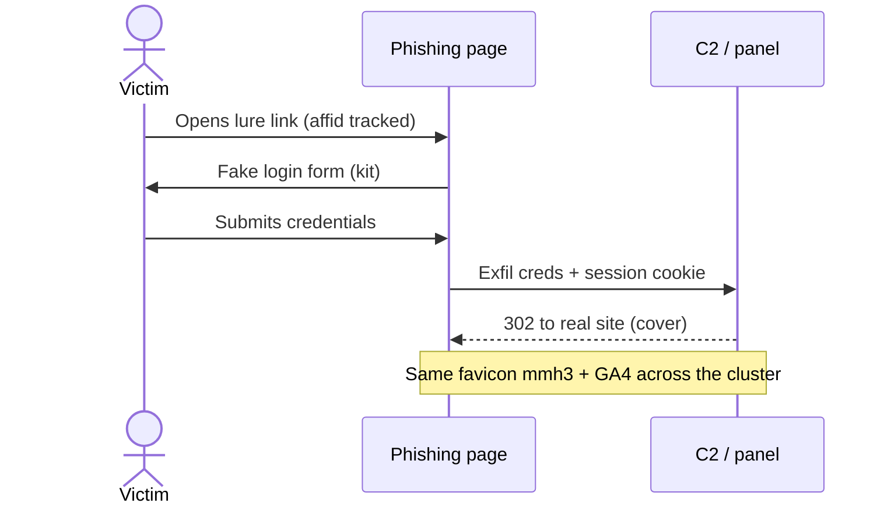
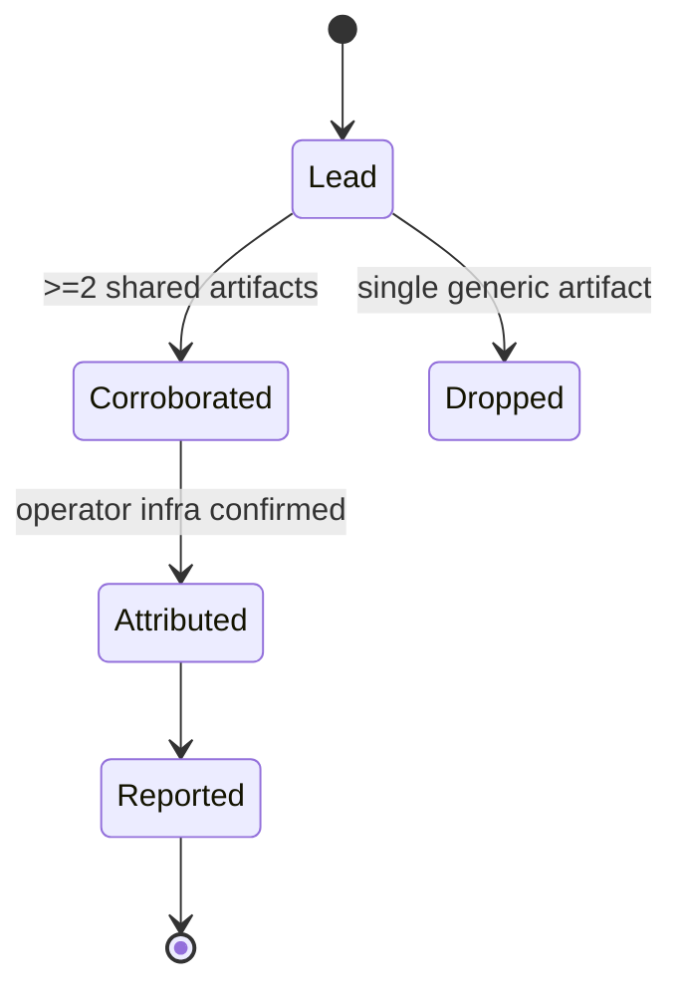

# CTI Diagram Patterns

cti-expert renders visuals as **ASCII by default** and **Mermaid on `--mermaid`** (see
SKILL.md § Visual Outputs and [`render-engine.md`](render-engine.md)). This file adds two
things: a **compile-check discipline** so a diagram never ships broken, and a map of **which
diagram type answers which CTI question**.

## Compile-check before you present

Never hand the user a diagram you haven't validated. A Mermaid block with one syntax slip
renders as a red error box in their report — worse than no diagram.

- **Validate before embedding.** Round-trip the Mermaid through a renderer first —
  `mmdc -i x.mmd -o x.svg` (mermaid-cli), a Kroki request, or mermaid.live. If it errors, fix
  and re-check. When the output is an HTML artifact/preview, confirm it actually renders.
- **Keep node labels safe.** Wrap any label containing spaces, punctuation, or `()[]{}<>":;` in
  quotes: `A["admin(1) panel"]`. Don't start an edge label with a reserved word
  (`end`, `graph`, `subgraph`). One statement per line.
- **Prefer small.** A diagram that doesn't fit on one screen isn't communicating — split by
  phase or subgraph. IPs, hashes, and long URLs go in a side table, not in node text.

## Which diagram for which CTI question

| What you want to show | Diagram | How cti-expert renders it |
|---|---|---|
| Actors exchanging **over time** — intrusion steps, C2 beacon/check-in, kill-chain, phishing → credential → payment | **Sequence** | Mermaid `sequenceDiagram` (`/render … --mermaid`) |
| One entity's **lifecycle / states** — case status, malware execution states, incident phase, account-takeover progression | **State** | Mermaid `stateDiagram-v2` |
| A **process with roles/handoffs** — investigation workflow, money-laundering flow across mules, triage escalation | **Swimlane / activity** | Mermaid `flowchart` with one `subgraph` per lane |
| **Infrastructure topology** — threat-actor infra, shared-hosting/CDN-vs-origin map, pivot cluster | **Graph / architecture** | `/render network` (ASCII) or `graph_build.py` → interactive HTML |

**One case usually needs several complementary diagrams, not one.** They answer different
questions and don't compete: an intrusion write-up might carry a *sequence* (the attack), a
*state* diagram (incident lifecycle), and an *infra graph* (C2 + staging + shared trackers).
Draw to communicate, not to decorate — a two-step linear process is a sentence, not a flowchart;
a two-state toggle is a clause, not a state diagram.

## Attack-sequence pattern (Mermaid)

## Case-lifecycle pattern (Mermaid)

## Infra cluster from a pivot run

`graph_build.py` ([`techniques/web-pivot.md`](../../techniques/web-pivot.md)) emits a clustered
node/edge graph — domains plus shared **favicon / GA / wallet / SaaS-token** hub nodes, with
Louvain communities and betweenness centrality. Render it as the **interactive HTML network**
([`render-engine.md`](render-engine.md)), or summarize the top cluster as a Mermaid `flowchart`
where each shared hub is a diamond node linking the domains that reuse it. Always label edges
with the **evidence** (`favicon mmh3`, `GA4 G-…`) so the graph states *why* two nodes connect.
